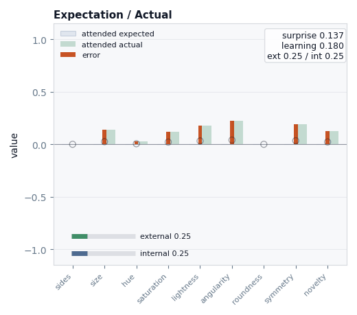
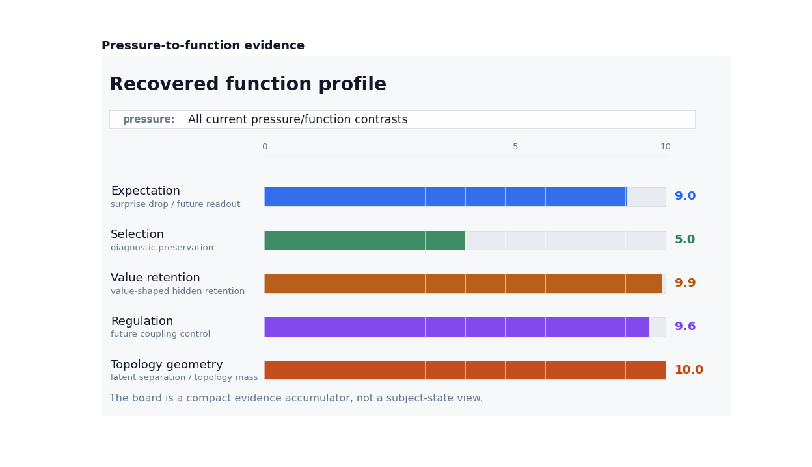

# Cave

Cave uses Plato's allegory as a design frame for computational functions often
invoked in consciousness research: sensing, attention, memory, expectation,
error, learning, value, action/exposure, and topology-like state.

Our goal is to make subject-side trajectories executable and inspectable: how an
external sequence becomes available to a situated system through particular
channels, limits, expectations, retained state, and future coupling.

The included tutorials and papers build that idea in three steps:

- build and render one subjective trajectory;
- compare trajectories across subjects, experiences, populations, and
  substrates;
- run pressure experiments that ask whether Cave-like functional roles become
  useful when simple systems face delay, bottleneck, value, and exposure
  demands.

We start with a simulation of the cave. Clockwise from top left:

1. A fixed point of view observes a wall against which objects appear.
2. The objects recede into the observer's memory
3. They are filtered by the observer's attention
4. The observer develops internal expectations
5. The observe develops internal predictions
6. We measure the observer's experience.


For an even simpler version, we can imagine our cave dweller liberated, but experiencing only the objects he encounters:


in this case, given a simpler model, a simpler subjective trajectory emerges.

## Install

```bash
python -m pip install -e .
```

For development:

```bash
python -m pip install -e ".[dev]"
pytest
```

Optional producers may need extra dependencies:

```bash
python -m pip install -e ".[gpt2]"
```

## Build One Trajectory

Tutorial 1 and Paper 1 start with the same object: a temporal input sequence
passed through a configured subject.

An `ExperienceObject` is an external event with a time interval, feature vector,
salience, modality, and optional presentation metadata. A subject-side model
then decides what is sensed, attended, expected, missed, learned, retained, and
carried forward.

```python
from pathlib import Path

from cave import CaveProducer, default_views, demo_model
from cave.presentation.renderers import LayoutSpec, MatplotlibRenderer

out = Path("out/readme")
out.mkdir(parents=True, exist_ok=True)

episode = CaveProducer(demo_model()).run(dt=0.1)

renderer = MatplotlibRenderer(
    layout=LayoutSpec(columns=2, figsize_per_cell=(5.2, 4.2)),
)
renderer.save_animation(
    episode,
    default_views(),
    out / "trajectory.gif",
    dt=0.1,
    fps=8,
)
```

The same path is available from the CLI:

```bash
cave-render --demo --output out/readme/trajectory.gif --views all --columns 2
cave-run --demo --output out/readme/episode.json
```

The core update is easiest to see in the expectation/actual view: each timestep
has an expected vector, an attended actual vector, a signed error, a learning
rate, and an after-update memory state.



For the full API walkthrough, see
[Tutorial 1](notebooks/tutorials/01_intro_to_cave_subjective_trajectory.ipynb).
For the formal construction story, see
[Paper 1: Subjective trajectories](docs/papers/paper_subjective_trajectories.md).

## Configure A Subject

The native Cave subject is configured through `ModelParams`: attention, memory,
topology, learning, workspace compression, value/objective evaluation, and
optional action or exposure policy.

```python
from dataclasses import replace

from cave import AttentionProfile, MemoryParams, default_model_params

params = replace(
    default_model_params(),
    attention=AttentionProfile(mode="sine", level=0.55, amplitude=0.35),
    memory=MemoryParams(retention=0.86, decay_tau=2.0, max_age=5.0),
)
```

Attention changes the timing and strength of admission into the subject-side
update. Split-channel attention can also redistribute access across external
input, audio, and internal expectation.


## Inspect Episodes

`Episode` is the common contract. Native Cave, GPT-2 text runs, conversation
runs, CaveNet, and pressure-test substrates all adapt into this shape.

Each observation can contain expected input, actual input, memory state,
surprise, learning rate, attention, active inputs, and metadata. Views and
dashboards read that state; they do not mutate the run.

```python
print(episode.duration)
print(episode.vocabulary)
print(episode.observations[-1].memory_state)
print(episode.observations[-1].surprise)
```


The visual layer includes presentation, timeline, memory lookback,
expectation/actual, correction, affect/action, and subjective topology views.
Topology is an accumulated density over a chosen feature plane, useful as an
inspection surface rather than a literal mental map.


For view implementation details and image generation notes, see
[README image construction](docs/reporting/readme_image_construction.md).

## Compare Trajectories

Tutorial 2 moves from one trajectory to many. Comparison tools operate on
episodes, not screenshots: same world across different subjects, same subject
across different experience sequences, or different substrates exported through
the same `Episode` contract.

```python
from cave import episode_set, labeled_episode
from cave.presentation.renderers import (
    save_episode_set_dashboard,
    save_episode_set_distances_json,
)

episodes = episode_set(
    [
        labeled_episode(episode, id="baseline", label="baseline"),
        # labeled_episode(other_episode, id="low-capacity", label="low capacity"),
    ],
    id="subject_comparison",
    title="Subject Comparison",
    comparison_axis="subject configuration",
)

save_episode_set_dashboard(episodes, out / "comparison.png")
save_episode_set_distances_json(episodes, out / "comparison_distances.json")
```

Built-in embeddings include observed memory, state effect, actual input, and a
broader subjective trajectory embedding.

```text
observed memory = what the episode directly retained
state effect    = observed memory minus a matched baseline
trajectory      = expected, actual, error, memory, attention, and adaptation
```

State-effect subtraction is the key comparison idea: it isolates what the
current episode changed rather than confusing that change with prior state.


Population tools add factor labels such as treatment, start condition, subject
profile, mechanism condition, or substrate. They let a report ask whether
families of trajectories converge, separate, collapse under controls, or
preserve structure.


For the full comparison workflow, see
[Tutorial 2](notebooks/tutorials/02_comparing_experiences.ipynb).

## Pressure Experiments

Paper 2 and Tutorial 3 ask why certain trajectory-transforming functions should
appear at all. The working thesis is:

```text
capacity + pressure -> useful mathematical function
```

Cave's reference architecture installs roles such as expectation, selection,
value retention, regulation, and topology-like organization by design. The
pressure experiments then ask whether related functions can be recovered,
weakened, or disrupted under matched environmental demands and controls.

The package includes:

- `CaveNet`: a network-shaped realization of the Cave update path;
- `CaveNetConfig`: gains for attention, state input, expectation, surprise,
  learning, and topology;
- `CaveNetAdaptationPolicy`: pressure-shaped gain adaptation;
- minimal and evolved subject tests for recurrence, value, memory, selection,
  regulation, and exposure;
- controls for hidden reset, non-recurrence, temporal shuffling, removed
  memory, removed attention, and related capacity failures.

```python
from cave.pressure.tests.cavenet_pressure import (
    build_pressure_episode,
    check_cavenet_pressure,
)
from cave.pressure.tests.evolved_dissociation import check_evolved_dissociation

episode = build_pressure_episode("adaptive")
cavenet_summary = check_cavenet_pressure()
dissociation_summary = check_evolved_dissociation()
```

The CaveNet pressure trace makes adaptation explicit: named gains move over
time, then the resulting episodes can be compared through the same dashboard
surface.


Role evidence is reported as bounded functional resemblance, not coordinate
identity and not a consciousness claim.



The evolved-subject results are the strongest current non-reference case: a
compact recurrent subject learns exposure control in a delayed-value world, and
the readout collapses under matched controls.


For the pressure-result walkthrough, see
[Tutorial 3](notebooks/tutorials/03_pressures_cavenet_evolved_subjects.ipynb).
For the paper framing, see
[Paper 2: Functional role emergence under pressure](docs/papers/paper_functional_role_emergence.md).

## Reading Path

- [Tutorial 1](notebooks/tutorials/01_intro_to_cave_subjective_trajectory.ipynb):
  build an external sequence, configure a subject, run `CaveProducer`, inspect
  an `Episode`, and render views.
- [Tutorial 2](notebooks/tutorials/02_comparing_experiences.ipynb):
  compare same-world/different-subject and same-subject/different-world runs,
  then build population dashboards.
- [Tutorial 3](notebooks/tutorials/03_pressures_cavenet_evolved_subjects.ipynb):
  read the pressure-result ladder, CaveNet demos, evolved-subject controls, and
  cross-substrate comparisons.
- [Paper 1: Subjective trajectories](docs/papers/paper_subjective_trajectories.md):
  construction vocabulary for subjective trajectories.
- [Paper 2: Functional role emergence under pressure](docs/papers/paper_functional_role_emergence.md):
  pressure/capacity/function thesis and current evidence.

## Command Line

```bash
# Run an episode and export JSON.
cave-run --demo --output out/demo/episode.json

# Render a GIF.
cave-render --demo --views all \
  --output out/demo/trajectory.gif

# Generate the predefined report suite.
cave-report-suite

# Regenerate README media assets.
python scripts/generate_readme_assets.py
```

## Project Map

```text
cave/commitments/      reference roles: attention, memory, prediction, topology, value
cave/observation/      experience objects, episodes, producers, views, populations
cave/presentation/     renderers, reports, dashboards, topology surfaces
cave/substrates/       CaveNet, minimal subject, evolved subject
cave/pressure/         pressure tests, ablations, role recovery
docs/                  paper docs
notebooks/tutorials/   API-first tutorial notebooks
```
