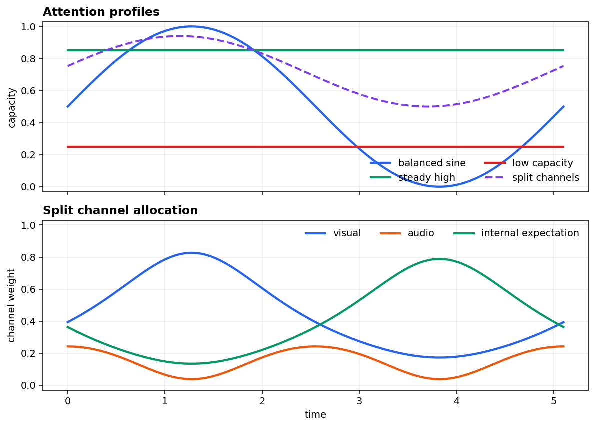
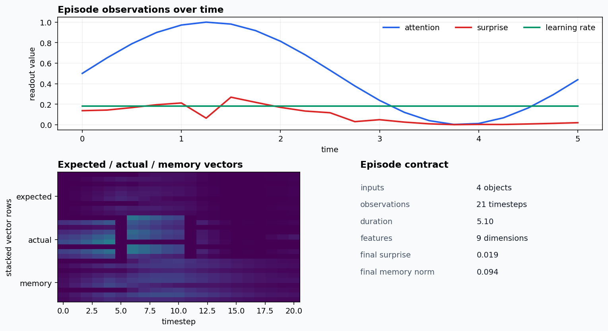
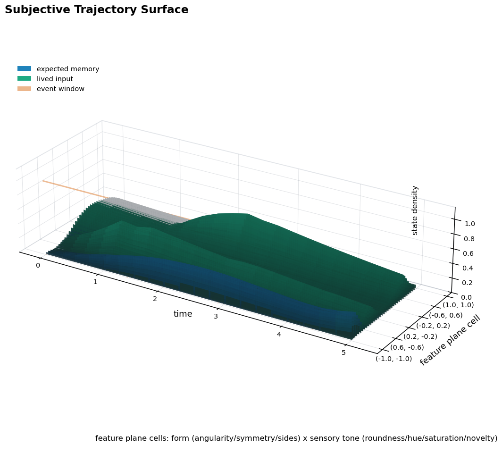
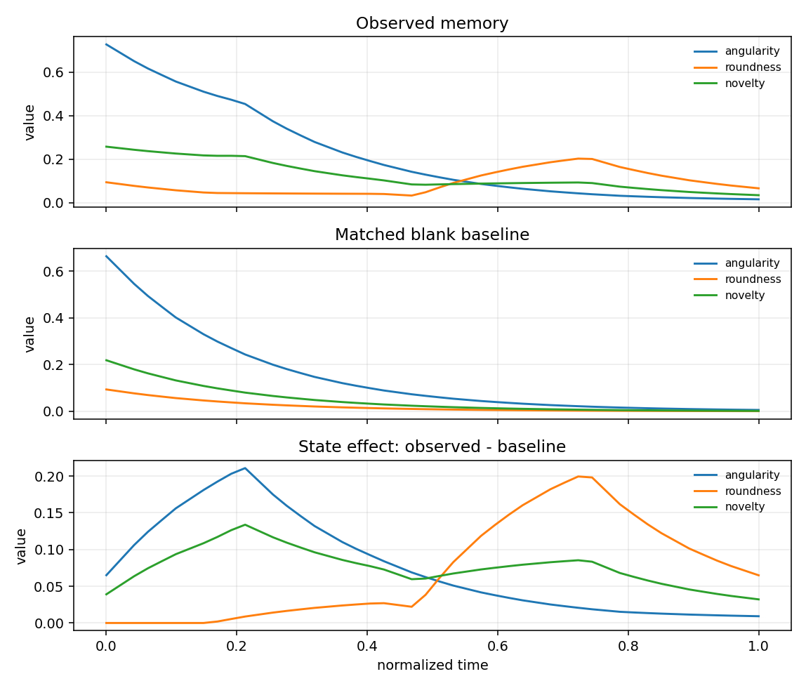
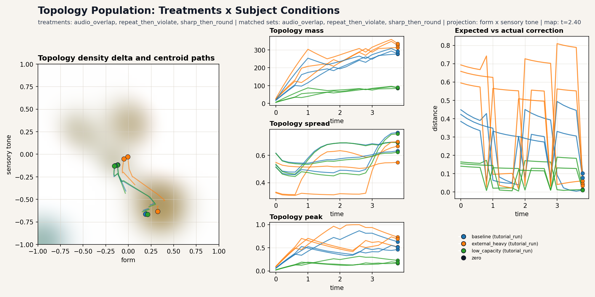
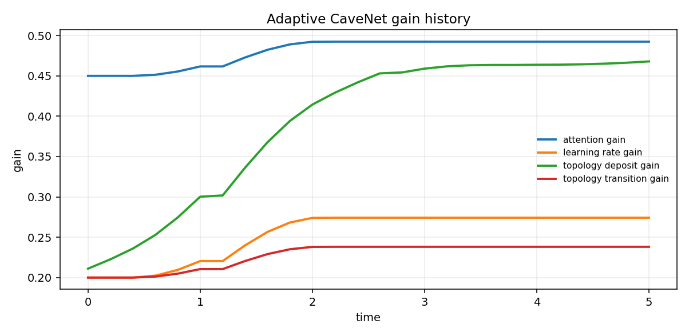
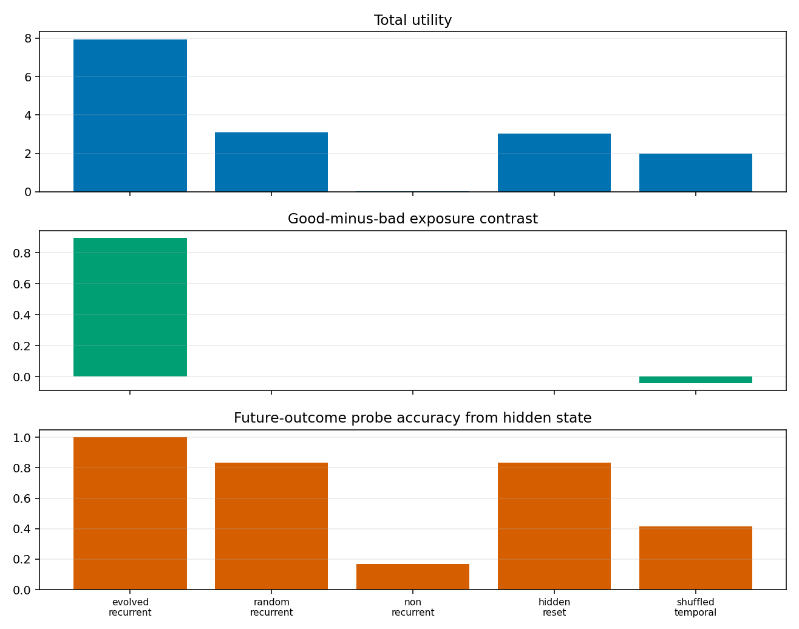
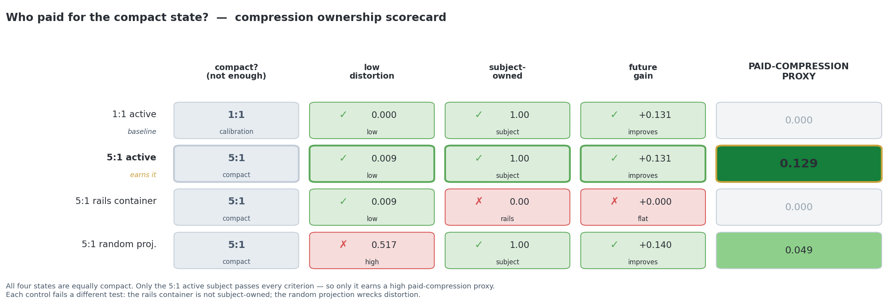
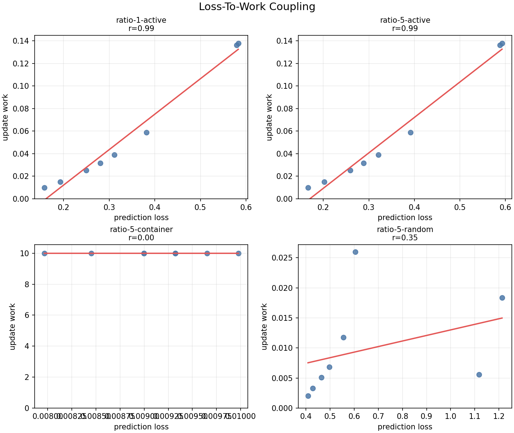
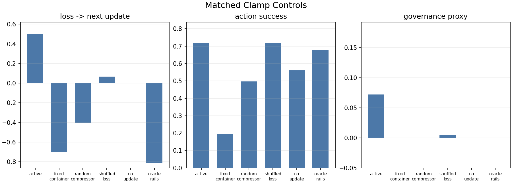

# Cave

Cave uses Plato's allegory as a design frame for computational functions often
invoked in consciousness research: sensing, attention, memory, expectation,
error, learning, value, action/exposure, and topology-like state.

From these functions we can glean an observable, transferrable model for the subject's experience over time: *the subjective trajectory*.

We start with a simulation of the cave, with panels as follows:

1. A fixed point of view observes a wall against which objects appear.
2. The objects recede into the observer's memory
3. They are filtered by the observer's attention
4. The observer develops internal expectations
5. The observer develops internal predictions
6. We measure the observer's subjective trajectory


This is the basis of the simulated cave. We have assumed only that the subject

1. has a memory (he thinks back)
2. has an expectation (he thinks forward) and
3. has an experience (he stares ahead).

We proceed below to compare trajectories on a population basis and to apply treatments to different subject substrates in an effort to see whether functional primitives arise independently. We find that matched pressure plus sufficient capacity reliably bends population trajectories toward four of the five reference roles.

To render your own, follow the tutorials:

1. [Build and render one subjective trajectory](notebooks/tutorials/01_intro_to_cave_subjective_trajectory.ipynb);
2. [Compare trajectories across subjects, experiences, populations, and substrates](notebooks/tutorials/02_comparing_experiences.ipynb);
3. [Run pressure experiments under delay, bottleneck, value, and exposure demands](notebooks/tutorials/03_pressures_cavenet_evolved_subjects.ipynb).

and for a deeper dive, read up on

1. [Subjective Trajectories](docs/subjective_trajectories.pdf): construction vocabulary for subjective trajectories.
2. [Functional Role Emergence Under Pressure](docs/convergence_under_pressure.pdf): pressure/capacity/function thesis and current evidence.

## Build One Trajectory

Tutorial 1 and Paper 1 start with the same object: a temporal input sequence
passed through a configured subject.

An `ExperienceObject` is an external event with a time interval, feature vector,
salience, modality, and optional presentation metadata. A subject-side model
then decides what is sensed, what expected content is generated from prior
state, what mismatch occurs, what is learned, retained, and carried forward.

```python
from pathlib import Path

from cave import CaveProducer, default_views, demo_model
from cave.presentation.renderers import LayoutSpec, MatplotlibRenderer

out = Path("out/readme")
out.mkdir(parents=True, exist_ok=True)

episode = CaveProducer(demo_model()).run(dt=0.1)

renderer = MatplotlibRenderer(
    layout=LayoutSpec(columns=2, figsize_per_cell=(5.2, 4.2)),
)
renderer.save_animation(
    episode,
    default_views(),
    out / "trajectory.gif",
    dt=0.1,
    fps=8,
)
```

The same path is available from the CLI:

```bash
cave-render --demo --output out/readme/trajectory.gif --views all --columns 2
cave-run --demo --output out/readme/episode.json
```

The core update is easiest to see in the expectation/actual view: each timestep
has a generated expected vector, an attended sensed actual vector, a signed
error, a learning rate, and an after-update memory state.


For the full API walkthrough, see
[Tutorial 1](notebooks/tutorials/01_intro_to_cave_subjective_trajectory.ipynb).

## Configure A Subject

The native Cave subject is configured through `ModelParams`: attention, memory,
topology, learning, workspace compression, value/objective evaluation, and
optional action or exposure policy.

```python
from dataclasses import replace

from cave import AttentionProfile, MemoryParams, default_model_params

params = replace(
    default_model_params(),
    attention=AttentionProfile(mode="sine", level=0.55, amplitude=0.35),
    memory=MemoryParams(retention=0.86, decay_tau=2.0, max_age=5.0),
)
```

Attention changes the timing and strength of admission into the subject-side
update. Split-channel attention can redistribute access across sensed channels
such as visual or audio input and generated channels such as internal
expectation.

That channel split is where Cave separates two objective signals:

```text
sensed input    = world-originating input admitted through sensors and attention
generated input = subject-originating expected input admitted through inward attention
actual input    = sensed input, or its workspace reconstruction when that bottleneck is engaged
error           = actual input - generated input
```

Generated input is not "less real" in the model. It is generated from prior
subject state, memory, and prediction capacity, then gated through the
`internal_expectation` attention channel. It is subject-relative because it
depends on the subject's history and configuration, but once those are fixed it
is an objective model signal. A subjective trajectory is the larger time-series
formed as sensed input, generated input, error, surprise, memory, value, and
topology evolve together.



## Inspect Episodes

`Episode` is the common contract. Native Cave, GPT-2 text runs, conversation
runs, CaveNet, and pressure-test substrates all adapt into this shape.

Each observation can contain expected/generated input, actual/sensed input,
memory state, surprise, learning rate, attention, active inputs, and metadata.
Views and dashboards read that state; they do not mutate the run.

```python
print(episode.duration)
print(episode.vocabulary)
print(episode.observations[-1].memory_state)
print(episode.observations[-1].surprise)
```



The visual layer includes presentation, timeline, memory lookback,
expectation/actual, correction, affect/action, and subjective topology views.
Topology is an accumulated density over a chosen feature plane, useful as an
inspection surface rather than a literal mental map.



## Compare Trajectories

Tutorial 2 moves from one trajectory to many. Comparison tools operate on
episodes, not screenshots: same world across different subjects, same subject
across different experience sequences, or different substrates exported through
the same `Episode` contract.

```python
from cave import episode_set, labeled_episode
from cave.presentation.renderers import (
    save_episode_set_dashboard,
    save_episode_set_distances_json,
)

episodes = episode_set(
    [
        labeled_episode(episode, id="baseline", label="baseline"),
        # labeled_episode(other_episode, id="low-capacity", label="low capacity"),
    ],
    id="subject_comparison",
    title="Subject Comparison",
    comparison_axis="subject configuration",
)

save_episode_set_dashboard(episodes, out / "comparison.png")
save_episode_set_distances_json(episodes, out / "comparison_distances.json")
```

Built-in embeddings include observed memory, state effect, actual/sensed input,
and a broader subjective trajectory embedding.

```text
observed memory = what the episode directly retained
state effect    = observed memory minus a matched baseline
trajectory      = expected, actual, error, memory, attention, and adaptation
```

State-effect subtraction is the key comparison idea: it isolates what the
current episode changed rather than confusing that change with prior state.



Population tools add factor labels such as treatment, start condition, subject
profile, mechanism condition, or substrate. They let a report ask whether
families of trajectories converge, separate, collapse under controls, or
preserve structure.



For the full comparison workflow, see
[Tutorial 2](notebooks/tutorials/02_comparing_experiences.ipynb).

## Pressure Experiments

Paper 2 and Tutorial 3 ask why certain trajectory-transforming functions should
appear at all. The working thesis is:

```text
capacity + pressure -> useful mathematical function
```

Cave's reference architecture installs roles such as expectation, selection,
value retention, regulation, and topology-like organization by design. The
pressure experiments then ask whether related functions can be recovered,
weakened, or disrupted under matched environmental demands and controls.

The package includes:

- `CaveNet`: a network-shaped realization of the Cave update path;
- `CaveNetConfig`: gains for attention, state input, expectation, surprise,
  learning, and topology;
- `CaveNetAdaptationPolicy`: pressure-shaped gain adaptation;
- minimal and evolved subject tests for recurrence, value, memory, selection,
  regulation, and exposure;
- controls for hidden reset, non-recurrence, temporal shuffling, removed
  memory, removed attention, and related capacity failures.

```python
from cave.pressure.checks.cavenet_pressure import (
    build_pressure_episode,
    check_cavenet_pressure,
)
from cave.pressure.checks.evolved_dissociation import check_evolved_dissociation

episode = build_pressure_episode("adaptive")
cavenet_summary = check_cavenet_pressure()
dissociation_summary = check_evolved_dissociation()
```

The CaveNet pressure trace makes adaptation explicit: named gains move over
time, then the resulting episodes can be compared through the same dashboard
surface.



Role evidence is reported as bounded functional resemblance, not coordinate
identity and not a consciousness claim.


The evolved-subject results are the strongest current non-reference case: a
compact recurrent subject learns exposure control in a delayed-value world, and
the readout collapses under matched controls.



For the pressure-result walkthrough, see
[Tutorial 3](notebooks/tutorials/03_pressures_cavenet_evolved_subjects.ipynb).

## Costs And Compression

Cave now treats costs as a cross-cutting measurement layer over the same
`Episode` traces. The question is not only what trajectory a subject forms, but
what had to be paid for that trajectory to exist:

```text
source load -> state capacity -> distortion -> update work -> future effect
```

Energy is one cost signal. Compression pressure is the broader frame. A compact
state can be supplied by rails, amortized from prior training, or actively
earned by the subject during the episode. The cost reports separate those cases
instead of treating every compact state as active compression.

The primitive compression report is the calibration case. It compares a 1:1
source/state condition with 5:1 pressure and controls where the compact state is
rails-provided or random-projected. The ownership scorecard is the core readout:
all four states are equally compact, but only the 5:1 active subject passes every
criterion — low distortion, subject-governed work, and future gain — so only it
earns a high paid-compression proxy. Each control fails a different test.



The coupling and overlay views connect the scalar cost readout back to Cave's
usual trajectory language: loss should predict update work, and that work should
sit on the same expected/actual/memory path rather than in a separate accounting
system.



The compression clamp report is the next step: capacity becomes the independent
variable. The same feature stream enters the subject while available state
slots tighten from open capacity into overload and then release. The readout is
not that compression went up; it is whether the subject reorganized attention,
memory update work, and response quality under the clamp.


The four-panel animation gives the time-bound version of the same claim:
pressure changes in one panel, while bottleneck selection, subject update work,
and response quality change in the other panels.


Matched controls separate that claim from visual persuasion. The active subject
beats a random compressor on useful selectivity, beats shuffled loss on lagged
loss-to-update coupling, beats no-update on response success, and beats an
oracle rails container on the adaptive-governance proxy because rails-supplied
compact state does not count as subject-governed work.


