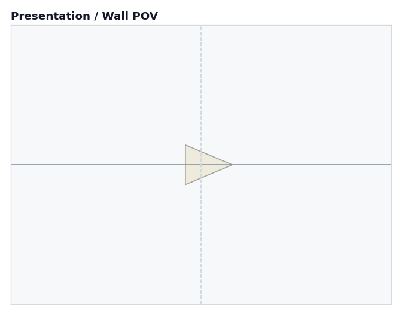
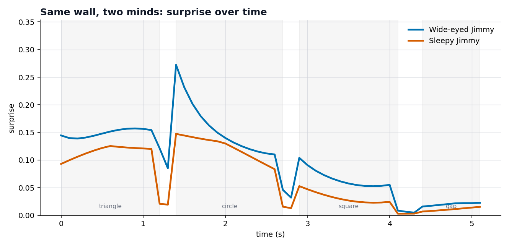
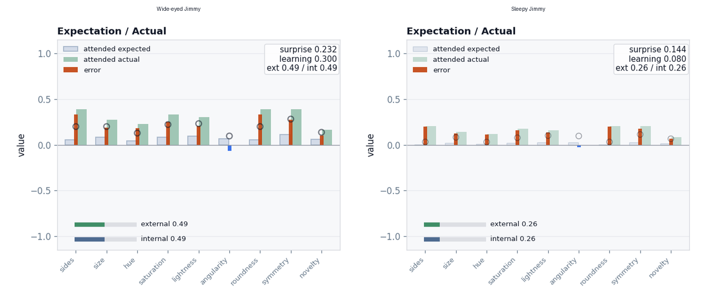
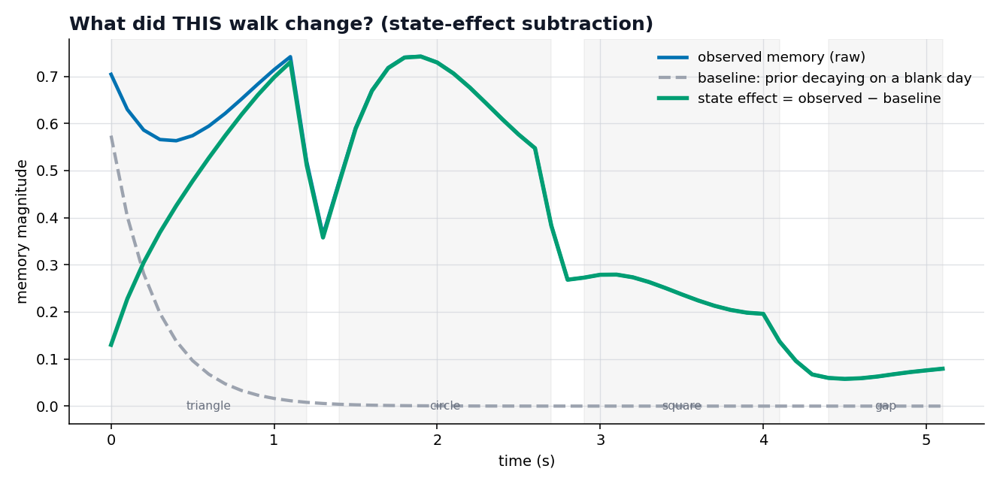
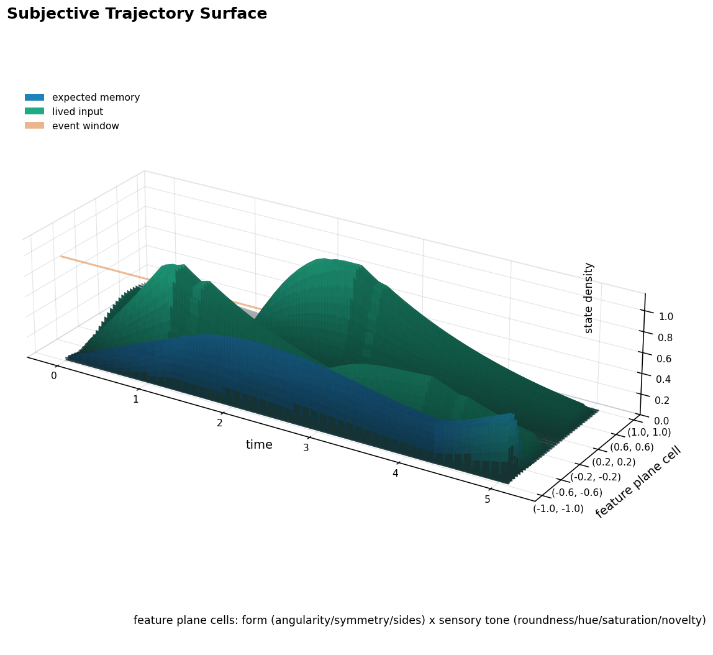
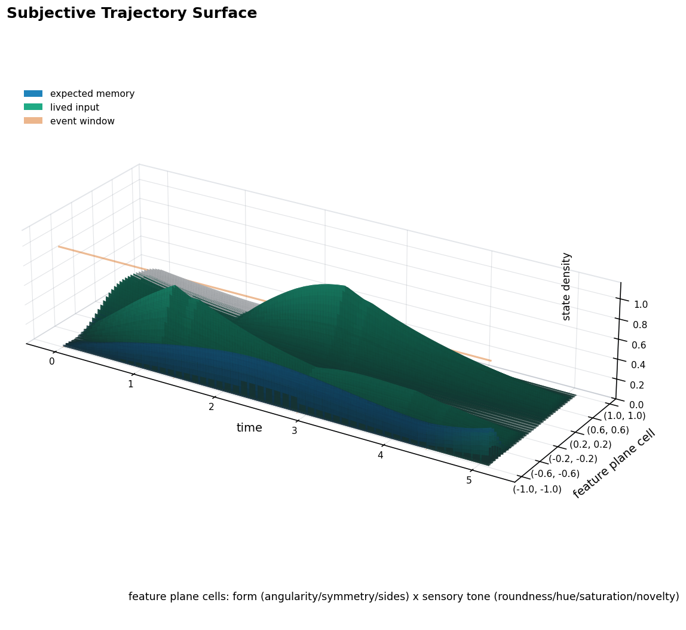
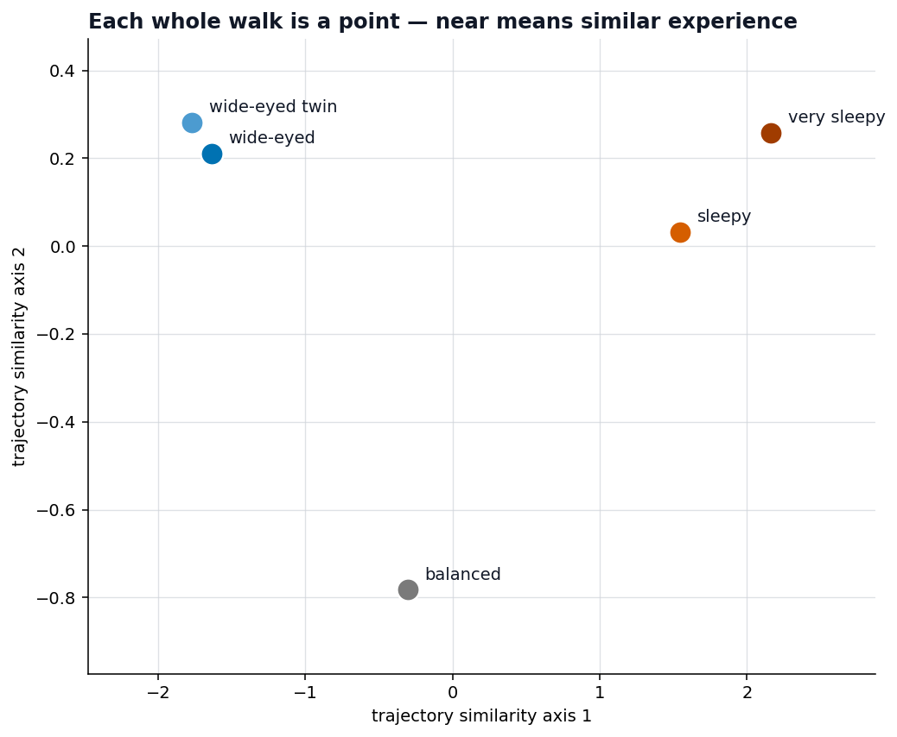
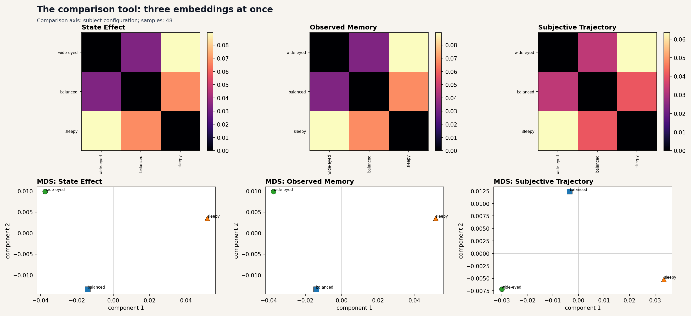
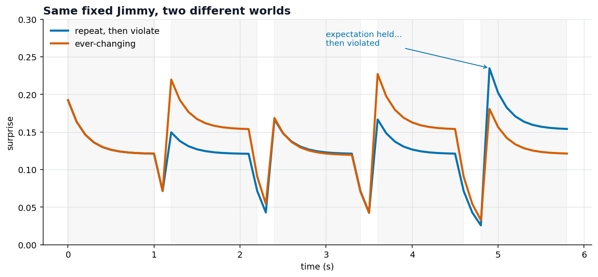
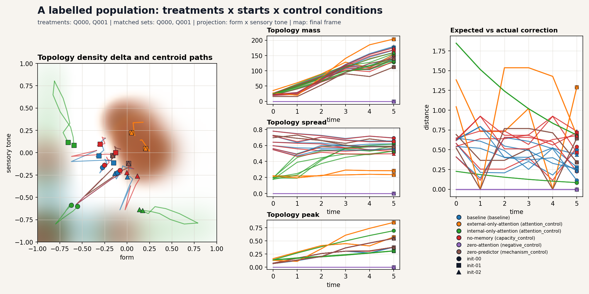

# Two Jimmys: the same wall, two different lives

This storybook follows **two** Jimmys (and then a whole crowd), walking down the
very same hallway of shapes, to make one idea concrete:

> **comparison is over trajectories, not screenshots**

You never compare two subjects by squinting at their pictures. You compare the
*paths their minds took* — surprise over time, the landscapes they build, what
each walk changed, and how far apart whole experiences land.

The book has two acts:

- **Act I — two minds, one world.** Meet two subjects and compare them every way
  Cave offers.
- **Act II — beyond two.** Hold the mind fixed and vary the *world*; then scale
  to a whole labelled population.

Meet the two protagonists:

- 🔵 **Wide-eyed Jimmy** keeps his eyes wide open and updates his memory quickly
  (high attention; fast learning, `learning rate ≈ 0.30`).
- 🟠 **Sleepy Jimmy** drifts along with half-closed eyes and a sluggish memory
  (low attention; slow learning, `learning rate ≈ 0.08`).

Same wall, same shapes in the same order (triangle → circle → square → gap).
Everything that differs from here on is *them*, not the world.

---

# Act I — Two minds, one world

## Page 1 — One wall, seen by both

Here's the wall: a triangle slides across, then a circle, a square, a quiet gap.
**Both Jimmys see exactly this.** So if their inner lives come out different, the
world can't be the reason. That is the whole setup of a comparison: hold the wall
still, change the mind.

## Page 2 — The same wall, two different surprise stories

One picture, two lines — each Jimmy's **surprise** at every instant. They are
never the same, and the gap is widest at the **circle** (`t ≈ 1.4`): Wide-eyed
jumps to **0.27**, Sleepy barely reaches **0.15**.

The counter-intuitive lesson: **the one who pays attention is the one who gets
more surprised.** Wide-eyed built a firm expectation of "triangle," so the circle
genuinely violated it. Sleepy never expected much, so there was less to violate.

## Page 3 — Why they diverge: look at the circle

Freeze both minds at the circle and put their **Expectation / Actual** panels
side by side. Wide-eyed (left): tall green "actual" bars over a clear triangle
expectation — `surprise 0.232`, `learning 0.300`. Sleepy (right): everything
small, admitting only a faint circle — `surprise 0.144`, `learning 0.080`. Same
circle; one is shaken and changed, the other hardly notices.

## Page 4 — What did *this* walk change?

Suppose Jimmy starts the day **already half-expecting triangles**. Then his raw
memory (blue) mixes *what he knew* with *what he saw*. To see only today's
effect, subtract a **blank day** (grey dashed — the prior just fading). The
result is the green **state effect**: it starts near zero, climbs as shapes
deposit, peaks at the circle, ebbs through the quiet end. That green curve, not
the raw blue one, is the honest answer to "what did today change?"

## Page 5 — Their inner landscapes differ

#### Wide-eyed Jimmy

#### Sleepy Jimmy

Surprise and memory are time-series; the **topology state surface** is the whole
*landscape*. It stacks each subject's feature-space density over time into a 3-D
terrain — the hills are where, and when, attention deposited experience.

Same wall, two different countries. Wide-eyed Jimmy carves **taller, sharper
ridges** — he attended hard, so each shape left a strong deposit. Sleepy Jimmy's
terrain is **shallow and smeared** — little got in, so little built up. The shape
of the landscape is a fingerprint of how a mind moved through the world.

## Page 6 — A whole walk becomes a single point

Now crush each Jimmy's **entire** walk — every expectation, error, surprise, and
adjustment — down to one point, placed so **near = experienced the world
similarly**. The two wide-eyed Jimmys land almost on top of each other; the two
sleepy ones cluster; the balanced one sits between. Each dot is a summary of a
whole subjective trajectory, and the distances are a real, numeric measure of how
differently five minds lived through one identical wall.

## Page 7 — The tool that does all of this

Everything so far we hand-built to explain it. Cave ships the tool: the
**episode-set dashboard**. Hand it a set of labelled episodes and it computes
**three embeddings at once** — observed memory, state effect, and the full
subjective trajectory — lays each out as a 2-D map (the same *near = similar* idea
as page 6), and prints the exact pairwise **distance matrices** beside them. (The
distances are also written to JSON, so the comparison is a number you can act on,
not just a picture you can admire.)

---

# Act II — Beyond two

## Page 8 — Hold the mind fixed; vary the world

So far we varied the *mind*. Now we hold one Jimmy fixed and change the *world*.

- **repeat, then violate** (blue): four triangles, then a circle. Surprise sits
  flat around **0.12** as his expectation locks onto "triangle" — then the circle
  lands and it **spikes to 0.24**. Expectation held, then was violated.
- **ever-changing** (orange): a different shape almost every step, so surprise
  **sawtooths** the whole way — low on the familiar triangle, high on each new
  shape.

Same machinery, two completely different surprise stories. The world deforms the
subject just as surely as the subject colors the world — which is exactly why
both axes of comparison matter.

## Page 9 — Scale to a labelled population

Finally, zoom out from a handful to a **population**, and label every run by
factors: which input sequence (treatment), which starting condition, and which
mechanism variant — **baseline** vs. controls like *zero attention* and *no
memory*. The population topology dashboard shows where each family's experience
concentrates in feature space, the centroid paths over time, and how the control
conditions pull away from the baseline.

This is the step that turns a comparison into an **experiment**: a baseline, a set
of matched controls, and a readout of how far each control departs — and asking
"does the behaviour survive the controls?" is exactly what pressure testing is
about.

---

## That's the idea

> Hold the world fixed and vary the subject; or hold the subject fixed and vary
> the world — then compare the **trajectories**: over time (surprise), as
> landscapes (topology surfaces), against a baseline (state effect), as points in
> a space (distance), and across a labelled population (controls).

- The complete machinery with runnable code — embeddings, distance JSON,
  population records, topology atlases and migration views:
  [Tutorial 2: Comparing Experiences](../../tutorials/02_comparing_experiences.ipynb).
