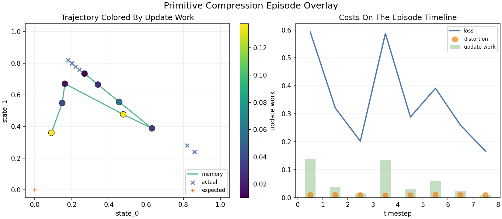
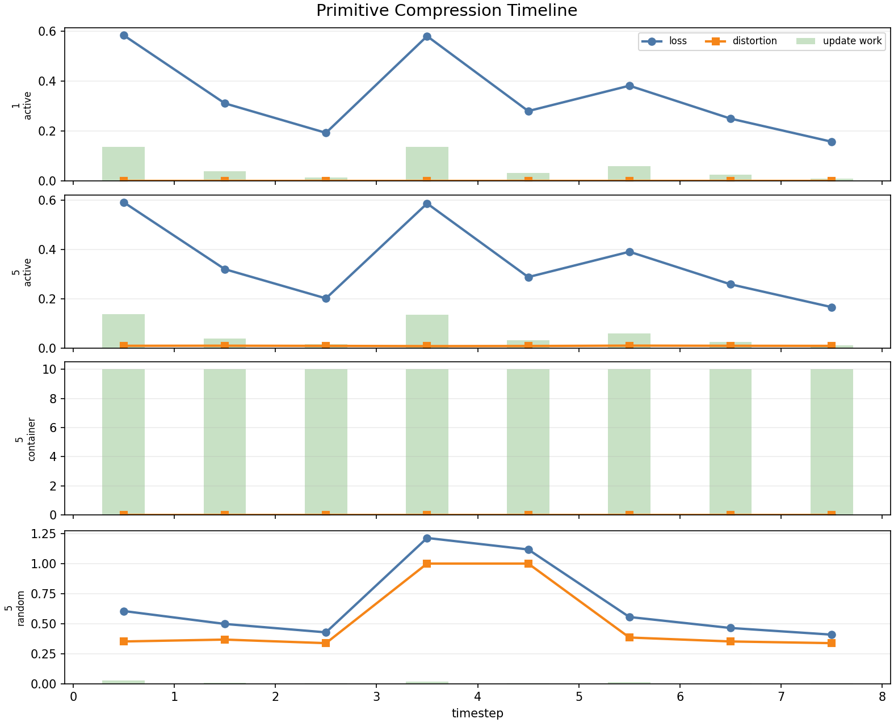
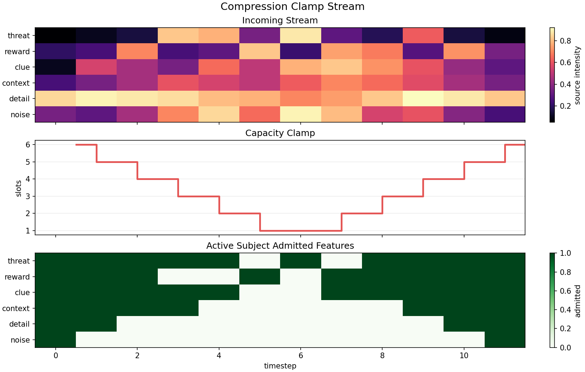
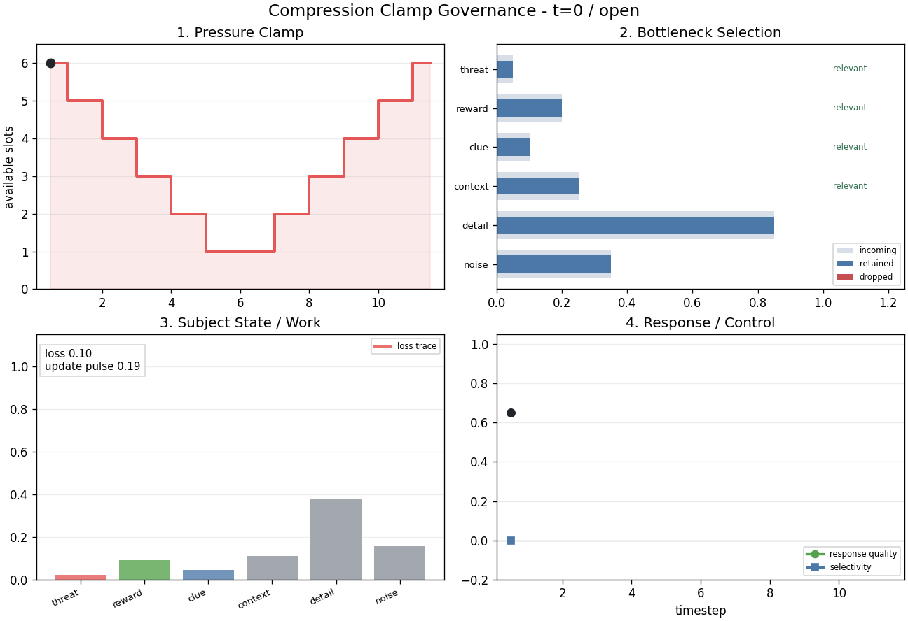

# Who paid for the thought? A costs-and-compression storybook

A **consciousness proxy**, in this storybook, is a compression-and-cost measure:
an estimate of how much useful compact state was produced by the subject's own
live organization, rather than supplied from outside.

It is not a declaration that a system is conscious. It is a disciplined stand-in
for one narrower question: when a system forms a compact state, did the system
itself do the organizing work?

The reason to start with compression is simple. Any subject has less state than
the world it meets, so it has to squeeze a richer stream into a smaller internal
form. If that squeeze preserves what matters, guides future action, and is paid
for by the subject's own updates, it starts to look like self-organization rather
than storage.

That gives the storybook its central question:

> **When a compact state appears, who paid for it — and did the payment change
> what happens next?**

The seductive wrong answer is **compression**. A subject with a small, compact
state *looks* impressive: it has squeezed a rich world into a few numbers. But a
compact state is cheap to fake, and the same small vector can mean four very
different things:

```text
a vector can be small because...
  the subject squeezed a rich stream under pressure   -> earned
  rails handed it a finished compact code             -> supplied
  a random projection crushed it                      -> accidental
  a model already paid the cost, during training      -> amortized
```

Compactness alone cannot tell these apart, so the hypothesis is deliberately
*not* "more compressed = more subject-like." It is:

```text
closer to the proxy = compression + loss-coupled work + matched controls
```

A subject moves toward the proxy when its **own** state spends more work
*because* loss or uncertainty rose, when that work **reduces future loss**, and
when **matched controls** confirm the effect was not rails, replay, or a lucky
projection. We call that earned version **paid compression**, and we read it off
the same episode along one chain:

```text
source load -> state capacity -> distortion -> update work -> future effect
```

So the storybook has one job: replace the cheap proxy (*how compact?*) with the
honest one (*who paid, and did it matter?*). It does that in three acts:

- **Act I — the calibration case.** Run the proxy on the simplest possible
  subject, where we already know which compression was earned.
- **Act II — the clamp test.** Make capacity itself the dial and ask whether the
  subject *governs itself differently* as the bottleneck tightens.
- **Act III — the cost ladder.** Use the proxy to separate compact states that
  were earned from compact states that were merely present.

```text
trajectory question:  what formed?
cost question:        who governed the work that made it possible?
```

---

# Act I — Compact is not enough

## Page 1 — The calibration case: four ways to look compact


Before trusting the proxy anywhere else, run it where the answer is already known.
That is the **calibration case**: a primitive *expect -> see -> measure surprise
-> correct* loop, fed a synthetic source we control completely. We run that one
loop four ways, and all four end with an equally **compact state**. The only
difference is who did the squeezing:

| Variant | Source vs state | Who does the squeezing |
| --- | --- | --- |
| `1:1 active` | equal — no bottleneck | baseline: nothing is forced to compress |
| `5:1 active` | five-to-one | the subject's own update loop, under pressure |
| `5:1 container` | five-to-one | nobody — rails hand it a finished compact code |
| `5:1 random` | five-to-one | a fixed random projection, blind to loss |

The calibration turns on the contrast between `5:1 active` and its two `5:1`
impostors: same pressure, same final compactness, different *payer*. We already
know the active subject is the only one earning its state — so if the proxy is any
good, it must light up that row and stay dark for the container and the
projection. That is exactly what the scorecard has to show before we trust it on
anything harder.

This is the central distinction of the whole storybook:

```text
compressed state != paid compression
```

All four states are equally compact (the `compact?` column), so compactness is
only the **container shape**, not the result. What separates them is the
conjunction of four costs, read left to right:

- **low distortion** — is the compact state a faithful squeeze or a lossy one?
  The random projection fails here (distortion **0.517** vs **0.009** for the
  active subject).
- **subject-owned** — did the subject's own loop pay the work, or did rails hand
  it the state? The container fails here (ownership **0.00**; the active subject
  **1.00**).
- **future gain** — did the compression actually improve later prediction? The
  container fails here (**+0.000**); the active subject improves by **+0.131**.
- **paid-compression proxy** — the bottom line, which only rises when the first
  three line up.

Notice the honest part: **no single column singles out the active subject.**
Distortion can't separate it from the container (both 0.009); future gain can't
separate it from random (0.140 ≥ 0.131). Each control fails a *different* test.
Only the **5:1 active** row is green across the board — and only it earns a real
paid-compression proxy (**0.129**, against essentially zero for the container and
0.049 for random).

Ownership is the missing word in a lot of compression talk. The cost-relevant
question is not whether a compact representation exists. It is whether the subject
loop allocated faithful, future-improving work **in response to its own
pressure**.

---

## Page 2 — Loss should move work


If the subject is actively compressing, loss should not be inert. A bad mismatch
or distortion now should predict update work soon after:

```text
loss_t -> update_work_{t+1}
```

The coupling plot tests exactly that, variant by variant: each point is one step,
prediction loss on the x-axis, the work the subject paid on the y-axis. The active
subject — at both 1:1 and 5:1 — lands on a tight upward line (**r = 0.99**): when
loss is high it pays work, when loss is low it rests. The controls break the line.
The rails container is flat (**r = 0.00**) — its state is overwritten wholesale,
so work has nothing to do with loss. The random projection is weak and noisy
(**r = 0.35**) — it changes dimensionality without governing the change.

That lag is what makes the claim non-circular. We are not saying "there was
pressure because a pressure number was high." We are asking whether pressure
changed what the subject did next — and only the active subject's work answers to
its own loss. That is the first honest test of paid compression.

---

## Page 3 — Put cost back on the Cave trajectory



Cost accounting should not become a detached scoreboard. It has to land back on
the same Cave trajectory: expected, actual, error, memory, and correction.

In the overlay, update work colors the memory path. The cost is not off to the
side of the episode — it sits on the path the subject actually took, brightest
where the subject moved its state the most.



The timeline gives the same reading in time, and the two costs behave very
differently. **Distortion stays flat and low (~0.009)** the whole episode: the
5:1 squeeze is faithful, step after step. **Work is not flat** — it rises and
falls with loss. On the surprising steps (loss ≈ 0.59) the subject pays the most
work (≈ 0.14); on the settled steps (loss ≈ 0.17) it barely moves (≈ 0.01). A
cost number matters when it explains how the trajectory changed, and here the
work line is a direct readout of where the episode demanded correction.

---

# Act II — The clamp test

## Page 4 — Make capacity the independent variable



The primitive 1:1 and 5:1 cases are static comparisons. The clamp report is a
harder test: send the *same* feature stream through a capacity schedule that
opens, tightens into overload, and then releases.

```text
open capacity -> overload -> release
```

Now capacity is the independent variable. The external load is held fixed — mean
pressure stays at **2.45** across every variant, so nothing that differs later
can be blamed on the world — while available state slots tighten and release
under the subject.

The test is not "does compression increase when capacity shrinks?" Of course it
does. The test is whether the subject governs itself differently under that
pressure — and because the stream is identical, any difference is the subject's.

---

## Page 5 — What should an active subject do under overload?



Under real compression pressure, an active subject should not merely become
smaller. It should become **selective** — and the numbers say it does.

The four-panel clamp animation reads as one causal sentence:

```text
capacity tightens
-> bottleneck selection changes
-> subject update work moves
-> response quality is preserved or recovered
```

Across the clamp, the active subject keeps **88%** of the task-relevant structure
while letting **irrelevant** structure fall to **31%** — a positive selectivity of
**0.57**. Its work stays loss-coupled under the squeeze (coupling **0.50**), its
action success holds at **0.72**, and once the clamp releases it recovers
(**0.27**). That is the stronger claim: **adaptive governance under pressure**. The
subject does not win by representing everything. It wins by dropping less useful
detail, retaining task-relevant structure, paying update work when loss demands
it, and recovering enough future response quality to show the work mattered.

---

## Page 6 — The controls that make the claim honest


The clamp controls try to make the active subject look good for the wrong
reasons. Each removes one capacity, and the active subject has to beat it on the
matching contrast:

| Control | What it removes | Active beats it by |
| --- | --- | --- |
| `random-compressor` | useful selectivity | selectivity **0.57 vs −0.07** (+0.64) |
| `shuffled-loss` | correct loss/work timing | coupling **0.50 vs 0.07** (+0.43) |
| `no-update` | memory/update work | success **0.72 vs 0.56** (+0.16) |
| `oracle-rails` | subject ownership | proxy **0.072 vs 0.000** (+0.07) |

The oracle case is the subtle one, and the numbers show why it matters. The
oracle subject *looks* great where you'd first glance — selectivity **0.58** and
action success **0.68**, because rails hand it a good compact state. But it never
pays for that state: its loss-to-work coupling is strongly **negative (−0.81)**
and its paid-compression proxy is **zero**. A useful compact state supplied from
outside is not subject-governed compression — which is exactly why ownership
belongs in the report.

---

# Act III — The cost ladder

## Page 7 — Six levels of evidence

The cost layer gives the result ladder a new axis:

| Level | Name | What it shows |
| --- | --- | --- |
| 1 | container | compact state exists, but rails supply it |
| 2 | recurrent updater | state changes with input, but compression pressure may be absent |
| 3 | active compressor under bottleneck | source/state pressure is explicit and subject-paid work appears |
| 4 | loss-coupled compressor | loss predicts update work and future loss improves |
| 5 | pressure-responsive controller | controller or gain work changes under pressure inside a richer substrate |
| 6 | low-rails adaptive subject | live uncertainty drives online cost with low rails dependence |

The evidence here is strongest at levels 1-4 in primitive and minimal form. The
primitive active loop is the clean level-3/4 case: subject-paid work (ownership
**1.00**), loss-coupled at **r = 0.99**, with **+0.131** future-loss improvement;
the clamp then shows that coupling and selectivity survive a *moving* bottleneck
and beat every matched control. Controlled CaveNet gives partial evidence for
level 5 because controller work and gain changes respond to pressure. The current
evidence does **not** establish level 6. That boundary matters: the proxy should
not turn a compact, useful state into a stronger claim than the measurements can
support.

---

## Page 8 — What changes across substrates

Cost accounting changes how several substrates should be read:

| System | Cost reading |
| --- | --- |
| Primitive active loop | the clean calibration case for subject-paid compression under explicit pressure |
| Primitive container | compact state without active compression |
| Minimal subject | the strongest current toy substrate for paid compression: bounded state, loss, update work, and positive coupling |
| Native Cave / fixed CaveNet | explicit mechanisms are visible, but fixed defaults should not be overread as live cost-responsive compression |
| Controlled CaveNet | promising because pressure changes controller/gain work, though explicit compression-pressure accounting is still incomplete |
| Evolved recurrent subject | important role evidence, but much cost may be amortized through evolution rather than paid during the live episode |
| GPT-2 / conversation | source-neutral episode surfaces; frozen inference mostly unfolds training-time compression unless online adaptation is added |

A trajectory can be functionally interesting while still leaving open who paid
for the state that made it possible. Cost accounting sharpens that distinction
instead of replacing the original result.

---

## Page 9 — The rule for future claims

A compression or cost result is stronger when all five pieces are visible:

```text
1. source/state pressure is explicit
2. distortion is measured
3. subject-paid work rises under loss
4. future prediction or control improves
5. matched controls rule out rails, replay, and random projection
```

Do not trust a pretty compact state by itself. Ask whether the compact state was
earned under pressure, whether the subject governed the work, whether the work
changed the future, and whether the controls took away the cheap explanations.

> **The trajectory question:** what formed?
>
> **The cost question:** who governed the work that made it possible?

That is what cost and compression accounting add to the corpus.
