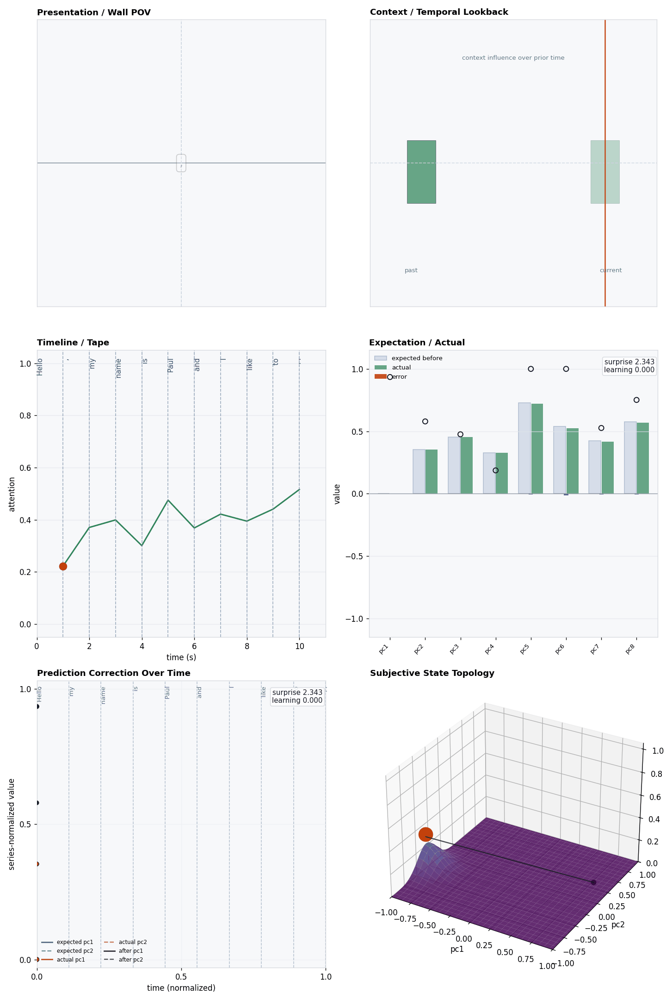
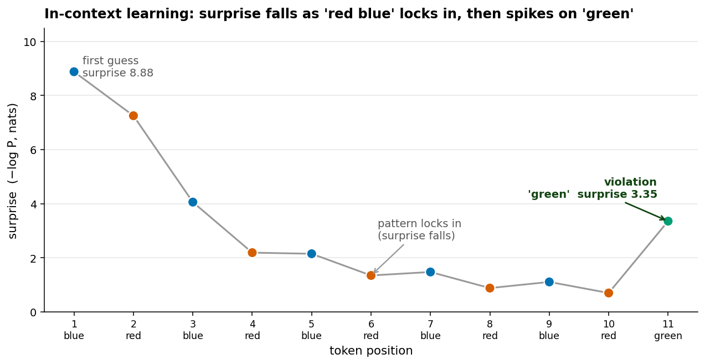

# What GPT-2 expects next: a language model read as a Cave episode

Cave's update loop was built to watch a little creature meet shapes on a wall:
**expect → see → measure the surprise → correct.** This storybook does something
that sounds like a category error — it points that same instrument at a **GPT-2
language model** and asks it to read one sentence, one token at a time.

The honest framing first, because the whole book hangs on it: GPT-2 does **not**
run Cave's loop inside itself. It has no expectation buffer, no memory trace that
steps toward what it just saw, no topology. What it *does* have, on every forward
pass, are quantities that play the **same roles** — a predicted distribution over
the next token, the token that actually arrived, a hidden state, attention over
context. The `GPT2Producer` maps those role-equivalents onto the Cave `Episode`
contract, so the exact same six views, renderers, and comparison tools can read a
transformer's step the way they read Jimmy's.

The sentence we read is:

```text
"Hello, my name is Paul and I like to "
```

The pipeline is one frozen forward pass — no generation, no sampling, no weight
updates:

```text
text
  -> tokenizer
  -> GPT-2 forward pass (hidden states + attention exposed)
  -> GPT2Producer.run(text)
  -> Episode (one observation per token, positions 1 .. N-1)
```

Position 0 is skipped on purpose: the first token has no prior context to be
predicted *from*, so there is nothing to be surprised about yet.

---

## Page 1 — One token, six panels


This is the same six-panel dashboard the native model uses, frozen on a single
step: GPT-2 has just read the token **"and"** (about position 6 in the sentence).
Read it the way you'd read any Cave frame:

- **Presentation / Wall POV** — what's "in front of" the model right now: the
  current token, `and`.
- **Context / Temporal Lookback** — instead of a fading memory image, a heatmap of
  **which earlier tokens the model attended to** when reading this one.
- **Timeline / Tape** — attention *concentration* over the sentence so far. It is
  not a smooth wave like Jimmy's; it's whatever the transformer's own attention
  happened to do, token by token.
- **Expectation / Actual** — the projected feature vector (the producer's default
  eight principal components, `pc1 … pc8`): what the model **expected** the next
  embedding to be vs. what **actually** arrived. Top right: **surprise 3.336**,
  **learning 0.000**.
- **Correction / Feature Plane** — the same mismatch as geometry: `expected`
  sits far to the left (≈ −1.0 on pc1), `actual` lands to the right (≈ +0.75), and
  a long arrow connects them. That arrow is a big prediction error.
- **Subjective State Topology** — a single sharp peak, derived from the episode
  the same way it is for native Cave.

Two of those numbers are the whole story of this book in miniature: a **real,
large surprise (3.336)** sitting right next to a **learning rate that is exactly
zero**. Hold onto both.

---

## Page 2 — The mapping, slot by slot

Every Cave observation has the same slots. Here is what each one is *made of* when
the subject is GPT-2, and the choice behind it:

| Cave slot | What it's filled with for GPT-2 | The choice |
| --- | --- | --- |
| **expected** | `Σ_v P(v) · embedding(v)` — the probability-weighted *average* of all next-token embeddings, from the logits at the previous position | An autoregressive model predicts a **distribution over tokens**, not an embedding. We collapse that distribution to one point in embedding space so it can sit beside `actual`. |
| **actual** | the embedding of the token that really came next | The honest "what happened," in the same space as `expected`. |
| **error** | `actual − expected` (Cave's standard) | Falls out for free once both live in one projected space. |
| **surprise** | `−log P(tokenₙ)` given the prior context, in nats | This one is *not* an analogy — it's genuine token surprisal (cross-entropy). The cleanest one-to-one in the whole mapping. |
| **memory_state** | the final-layer hidden state at this token | A **role-equivalent**, not a trace. It's the state GPT-2 actually uses to predict the next token — but it was computed in one pass, not accumulated. |
| **learning_rate** | **0.0**, always | A forward pass changes no weights. We refuse to invent a learning signal, so this slot is honestly empty. |
| **attention** | `1 − H(weights)/log n` — entropy-based *concentration* of the model's own attention over context | High when the model focuses on a few tokens, low when it spreads out. Derived from real attention, head-averaged on the final layer. |
| **active inputs** | the top-k attended context tokens (default), or full / current-token | A selection *for display* — which prior tokens to draw as "what's being looked at." |
| **features / projection** | every vector squeezed through a **per-prompt PCA** (768 dims → 8), normalized to [0,1] | GPT-2's spaces are huge; we need two readable axes. The basis is fit fresh for *this sentence*. |

The single most important design decision is what `expected` means. Jimmy's
expectation *is his previous memory* (`E_t = M_{t-1}`). GPT-2's expectation is the
model's **next-token distribution**, which has nothing to do with the hidden state
we stored as "memory." So the tidy Cave identity `E_t = M_{t-1}` **does not hold
here** — and that's the first place to be careful.

---

## Page 3 — Where it genuinely looks Cave-like

Some of the resemblance is real, not forced:

- **Surprise is surprise.** `−log P(token | context)` is exactly "how unexpected
  was what just happened," measured in the model's own currency. Predictable tokens
  (`my` after `Hello,`) score low; a token the model didn't see coming spikes — the
  **3.336** on the frame is a real, large mismatch, the same shape of event as
  Jimmy meeting the snake.
- **There is a true expect-then-see step.** Before the token arrives, the model
  *has* a distribution; after, there's a concrete token; the gap between them is a
  real error. The expect → see → error skeleton is present, computed from the model
  rather than imposed on it.
- **Attention is the model's own.** The concentration scalar and the context
  heatmap come straight from GPT-2's attention tensors — we're reading a real
  internal signal, not a proxy. When the model piles attention onto one or two
  prior tokens, the Timeline rises; when it spreads, it falls.
- **The correction geometry is meaningful per step.** The long arrow on the
  feature plane on the `and` frame is a faithful picture of a step where the
  model's expected embedding and the actual token's embedding were far apart.

Run the whole sentence and these line up into something that reads like a Cave
trajectory:



---

## Page 4 — Where it falls short (and we say so)

The frame already told us: **surprise 3.336, learning 0.000.** That zero is the
fault line.

- **The fourth move never happens.** Cave's kernel ends with `M_t = M_{t-1} +
  η·error` — memory steps toward what surprised it. GPT-2 in inference does none of
  that. There is surprise, but **nothing corrects**. The "memory" at each step is a
  read-off hidden state, not the running accumulation of past corrections. So the
  green "memory path" that means so much for Jimmy isn't a learning trajectory
  here — it's a tour of the model's states.
- **`expected` is a distribution flattened to a point.** Collapsing
  `Σ P(v)·emb(v)` is interpretable but lossy: a confident prediction and a
  hedged-but-centered one can land in the same place. The error vector mixes a
  probability-weighted average against a single token embedding — readable, but not
  the clean apples-to-apples that native Cave enjoys.
- **The geometry is local to one prompt.** The PCA basis is re-fit per sentence, so
  `pc1`/`pc2` mean different things for different prompts. Comparing two GPT-2 runs
  by their raw coordinates is **not valid** — the producer's own docs flag this, and
  cross-source comparison needs explicit summary metrics or a shared basis.
- **Topology is derived, not native.** GPT-2 maintains no Cave topology grid; the
  surface in the corner is reconstructed *from the emitted episode* by the same
  source-neutral code used everywhere else. It's a fair lens on the run, not
  something the model "has."
- **It's a single forward pass, teacher-forced.** No continuation is generated, no
  sampling temperature applies, no weight changes. We are inspecting one read of a
  fixed sentence — a snapshot of computation, not a life lived.

---

## Page 5 — But across a window, surprise *does* fall

Page 4 said the correction loop is missing in one frozen step. Widen the view from
a single token to a **window**, though, and something genuinely Cave-like appears —
not because we added a mechanism, but because GPT-2's surprise is always read
**conditioned on the growing context.**

Feed it a repeating pattern and watch the surprise slot:



The prompt is `red blue red blue … red green`. On the first `blue` the model is lost
— **surprise 8.88**, it put a near-zero probability on the token that actually came.
But it picks up the alternation fast: by the tenth token (`red`) surprise has fallen
to **0.70** — a **~12× drop** — with the model now placing ~0.50 on the right next
word. Then the pattern breaks (`green` instead of `blue`) and surprise **spikes back
to 3.35.**

That curve is the exact shape of Jimmy meeting three trees and then a snake:
expectation builds, surprise falls, a violation spikes it. Only here it's a real
transformer, and the dynamic is its own **in-context learning** showing through
Cave's instrument.

Now the honest qualifier — and it's the whole subtlety of this book in one place:
**`learning_rate` is still 0.0.** No GPT-2 weight changed; no Cave memory trace
accumulated. The mechanism Cave names — `M_t = M_{t-1} + η·error` — is still absent.
What's present is the *behavioural signature* of learning, produced by the
transformer conditioning each prediction on a longer prefix. So this is the cleanest
illustration of the project's own refrain: **functional resemblance, not identity.**
The behaviour matches; the machinery does not — and the contract is sharp enough to
show you both at once.

(One detail the markers encode: the model never gets *certain* — its top probability
tops out near 0.50 — because after `red` the sensible next word genuinely could be
`blue` or some other colour. It learned the *pattern*, not a fixed answer.)

---

## Page 6 — What scales, and what only looks like it scales

Because every run still exports a valid `Episode`, the population tooling runs over
many GPT-2 reads. But this is exactly where an honest reading matters most:


The dots are reads under different **context-selection configs**
(`attended-top-1`, `attended-top-3`, `current-token`, `full-context`). Look at the
axis scales on **Experience Effect**, **Observed Memory**, and **Internal
Prediction**: they're at **`1e-9`** — for a given text the configs land essentially
*on top of one another*. That's not a bug to hide; it's the lesson. Changing how we
**select context for display** does **not** change GPT-2's computation, because the
**forward pass underneath is identical**. Those knobs are inspection knobs, not
changes to the subject.

The conversation producer makes the same point from the other side — the same
`Episode` contract reaches turn-by-turn dialogue:


Here the experience embeddings still collapse (same forward pass), but the
**Active Context** panel — the purely *structural* bookkeeping of which tokens were
selected — finally shows real spread. The configs separate **only** where they
actually differ: in what they looked at, not in what the model experienced.

---

## What the adapter earns us — and what it doesn't

> GPT-2 has no Cave loop inside it. The `GPT2Producer` maps its forward-pass
> quantities onto the `Episode` contract: the next-token distribution becomes
> `expected`, the arriving token becomes `actual`, token surprisal becomes
> `surprise`, the hidden state stands in for `memory`, attention concentration
> becomes `attention` — and `learning_rate` is honestly **0.0**, because a forward
> pass doesn't learn.

What that **earns**: a real language model becomes legible through Cave's views.
Surprise, expectation error, and attention are read from the model's own signals,
and the expect-then-see skeleton genuinely holds. The surprise slot even tracks the
model's **in-context learning** — it falls as a pattern locks in and spikes on a
violation — so a transformer and a hand-built subject can be placed side by side,
and made to show the same *behaviour*, because they speak one contract.

What it **does not** earn: a claim that GPT-2 remembers, corrects, or has a
subjective topology. The empty `learning_rate`, the proxy memory, the per-prompt
basis, and the config-collapse in the population view are all the same honesty in
different clothes — **the map fills the slots GPT-2 actually computes, and leaves
the rest blank.** The resemblance that survives that honesty is the part worth
trusting.

---

## Further reading

- The full adapter contract, timing, and current limits:
  [GPT-2 Producer](../../../docs/producers/gpt2.md).
- Getting the local GPT-2 weights to re-run any of this:
  [GPT-2 setup](../../../docs/producers/gpt2_setup.md).
- The other producers that fill the same contract (Cave, conversation):
  [Producers](../../../docs/producers/README.md).
- What "functional resemblance, not identity" does and does not license:
  [the scope note](../../../docs/orientation/scope_note.md).
