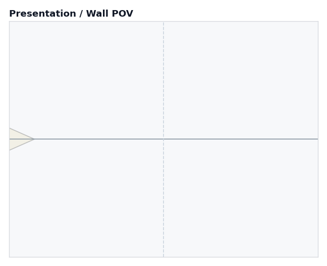
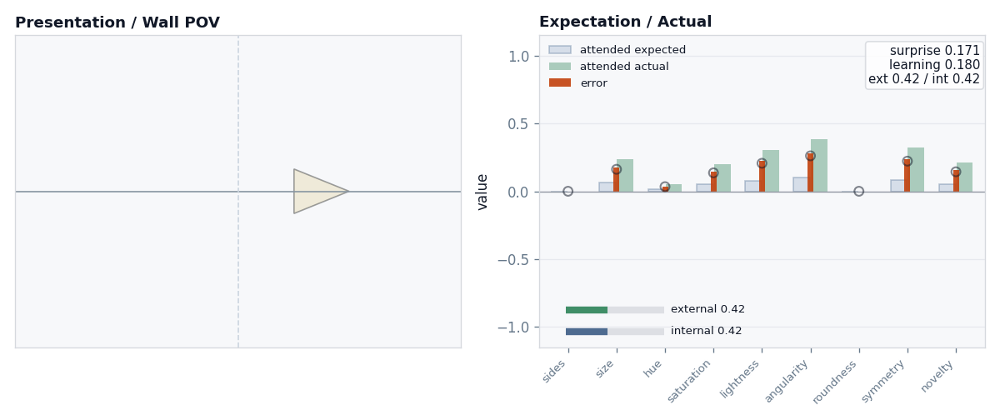
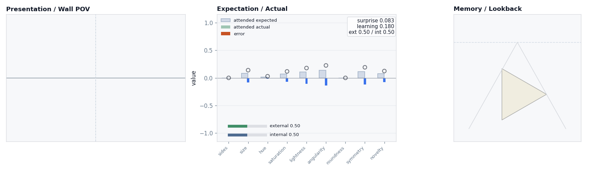
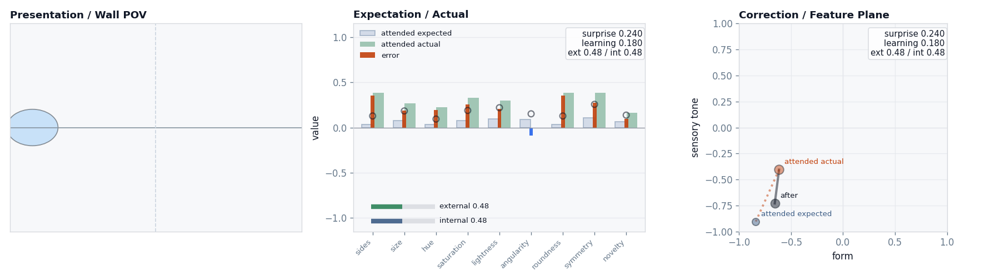
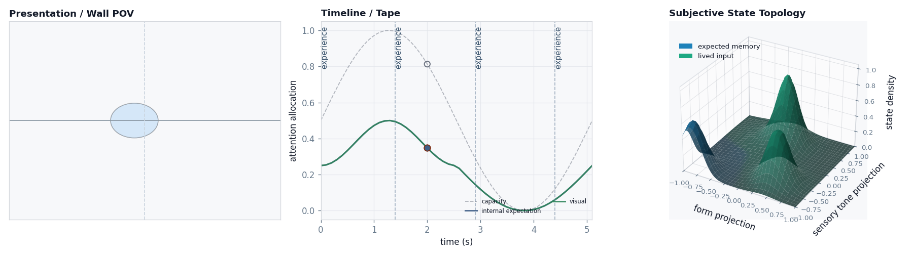
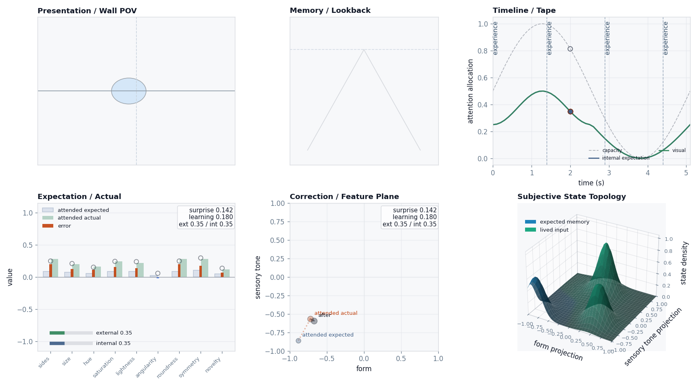

# Jimmy opens his eyes: the full Cave, one panel at a time

A little fellow named **Jimmy** watches shapes appear on a wall, and we follow
what happens in his mind using the real Cave model: nine-dimensional feature
vectors, two channels of attention, decaying memories, and the six standard
views. The loop underneath is simple — expect → see → measure the surprise →
correct — but here we **don't simplify** it away. We add one new way of looking
per page, so that by the end you can read the full six-panel dashboard without it
being a wall of charts.

The walk is the canonical demo sequence:

```text
triangle  [0.0 – 1.2)
circle    [1.4 – 2.7)     <- the surprise
square    [2.9 – 4.1)
gap       [4.4 – 5.1)
```

## The loop is still the same four moves

Only now each move is richer:

```text
expected = generated input from memory × inward attention
actual   = sensed input from the wall  × outward attention
error    = sensed actual − generated expected
surprise = how big that error is (root-mean-square)
memory  += learning_rate × (actual − memory)         memory steps toward actual
```

Two things that didn't exist in the flat version and matter here:

- **Attention has a level *and* a split.** A slow wave sets how wide Jimmy's eyes
  are open at each moment (the `ext`/`int` readout and the Timeline panel). And
  he divides that attention between looking **outward** (admitting sensed input
  from the wall) and **inward** (admitting generated expectation from prior
  state). Both are objective model signals; they have different sources.
- **A thing seen is nine numbers, not a point.** `sides, size, hue, saturation,
  lightness, angularity, roundness, symmetry, novelty`. The shape on the wall is
  just one way to draw that vector.

---

## Page 1 — A triangle on the wall



Jimmy opens his eyes. There's a triangle, sliding in from the left. For now we
show only one thing: **Presentation / Wall POV** — literally what is in front of
him. This is the one panel that is closest to "a picture."

It's the very first instant, and his attention is only half-open (`level = 0.50`)
— the wave hasn't risen yet, so even this triangle comes in faint.

---

## Page 2 — That triangle is really nine numbers



Half a second later, here's the move that makes Cave *Cave*. To Jimmy the
triangle isn't a picture — it's a **feature vector**, and the new panel
(**Expectation / Actual**) shows it as nine bars, three ways:

- 🟦 grey — **generated input**: what he expected (`attended expected`)
- 🟩 green — **sensed input**: what actually arrived (`attended actual`)
- 🟧 orange — the **error** between them

```text
attention level = 0.92   (the wave has swung almost fully open)
surprise = 0.171
expected ≈ a faint triangle    actual = a strong triangle
```

Two things to notice. The green bars are tall now because outward attention is
wide open. And the grey bars are **no longer flat** — half a second of triangle
has already built a generated expectation. Down in the corner, `ext 0.50 / int
0.50`: Jimmy is splitting his attention evenly between sensed input and
generated input.

---

## Page 3 — The wall goes blank, but Jimmy doesn't



The triangle ends; there's a gap before the next shape. The Wall is **empty**.

But look at the middle panel: the grey "expected" bars are **still standing** —
Jimmy is still expecting a triangle — while the green "actual" bars have dropped
to nothing. The error bars now point the other way: *"I expected something, and
got nothing."* Surprise is small (`0.083`) only because his expectation was
itself modest.

```text
attention level = 1.00   (the wave is at its crest)
surprise = 0.083
expected = triangle-shaped      actual = all zeros
```

The new right panel, **Memory / Lookback**, shows *why* he still expects it: the
triangle has just been filed away as a memory (the faint shape), and it will fade
with age. Expectation is memory pointed forward.

---

## Page 4 — A circle! (the violation)



This is the moment the whole instrument is built to show. A **circle** appears —
round, saturated, the opposite of a triangle in nearly every feature. Jimmy is
still primed for a triangle, so he is wrong almost everywhere at once: he expected
**angularity** and got **roundness**; he expected sharp, got smooth.

```text
attention level = 0.98
surprise = 0.240   ← the largest of the whole walk
expected: angular, low roundness        actual: round, zero angularity
```

The new panel, **Correction / Feature Plane**, says it as geometry. It takes the
nine numbers and projects them onto two readable axes — *form* and *sensory tone*
— then plots three points: where Jimmy **expected** to land (orange, low-left,
triangle-ish), where the input **actually** landed (up and to the right, the
circle), and **after** — where his memory moves to. Memory lands *between*
expected and actual: he corrects toward the surprise, but only part of the way.

It's the same move as ever — expect, see how wrong you were, close part of the
gap — only now in nine dimensions, shown in two.

---

## Page 5 — Two more ways to look: time, and the landscape



The circle is still on the wall. We add the last two views.

**Timeline / Tape** zooms out in *time*. It shows that attention was never
constant — it's a slow **wave**, and the marker shows we're just past its crest
(`level = 0.81`). That timing is not incidental: the circle hit so hard partly
*because* it arrived while Jimmy's eyes were wide open. As the wave ebbs, the
later square will barely register.

**Subjective State Topology** is the accumulated **landscape**. Every attended
moment drops a little deposit into that same form/tone plane; over the walk they
build up into hills — bright where Jimmy's experience has concentrated (so far,
heavily over "triangle"). It is a *trace* of the journey, not the journey itself.

```text
attention level = 0.81   (past the crest, beginning to ebb)
surprise = 0.142
```

---

## Page 6 — The whole instrument, one instant



Now you can read all six at once — the full dashboard — and you know each panel
now. They are **six views of one update**, not six different
things:

1. **Presentation** — the circle, as seen.
2. **Memory / Lookback** — the triangle, fading.
3. **Timeline** — where we are on the attention wave.
4. **Expectation / Actual** — the nine numbers: predicted vs. arrived.
5. **Correction** — that mismatch as a move across the feature plane.
6. **Topology** — the landscape all of it has been depositing.

Read left-to-right, top-to-bottom, it's one sentence: *Jimmy, attention high,
expecting the triangle he just filed away, instead met a circle; that mismatch is
the tall error bars, the long arrow on the plane, and the new bloom rising in the
landscape.*

---

## That's the full loop

Strip away the six panels and Jimmy did the very same thing he did walking past
the snake:

> **expect from memory → sense through attention → measure the surprise → correct part-way**

The full model just refuses to hide any of it: senses decide what gets in,
attention decides how much and from which channel, the prediction is gated memory,
and every step leaves both a corrected memory and a deposit in the topology. Two
different subjects — a sharper one, a more forgetful one — would turn the same
wall of shapes into different bars, different arrows, different landscapes. That
difference is the whole point of Cave.

- The same loop traced with full precision and every intermediate vector:
  [the update loop walkthrough](../../../docs/architecture/update_loop_walkthrough.md).
