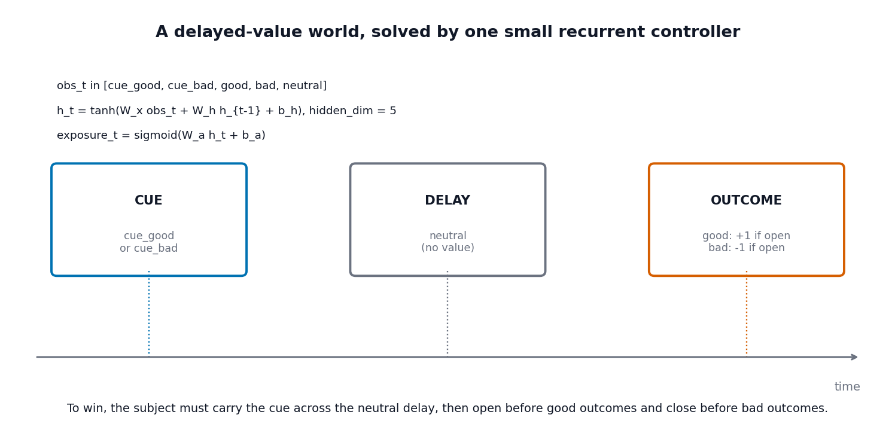
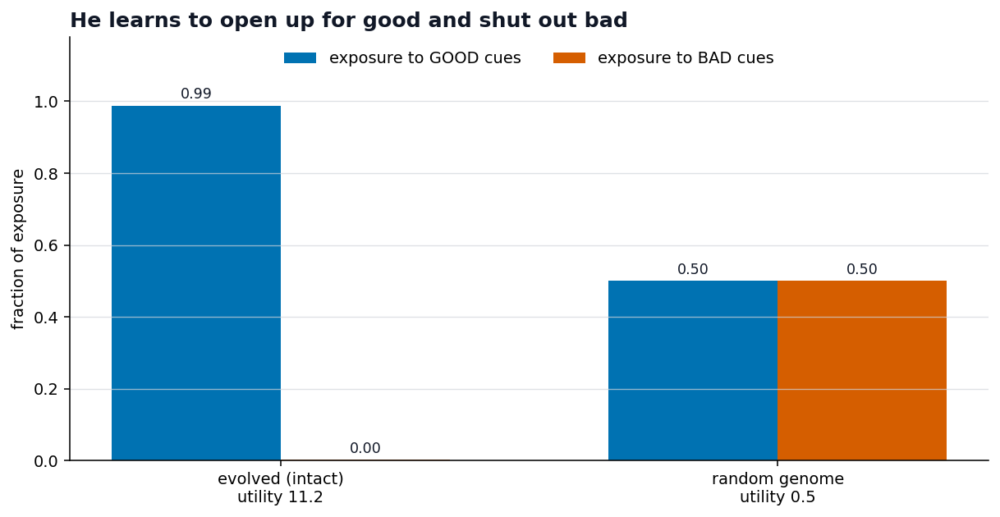
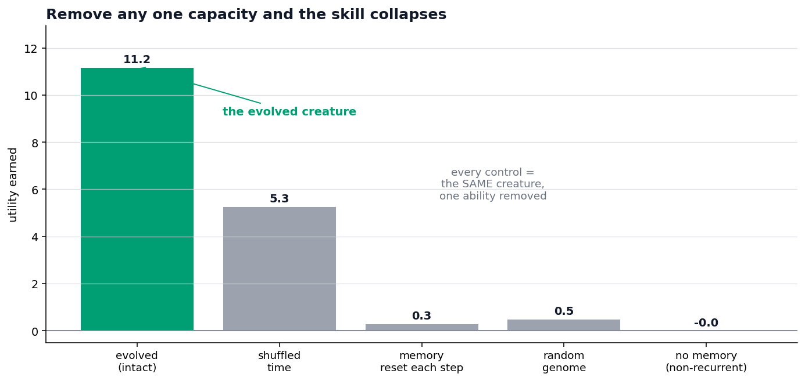
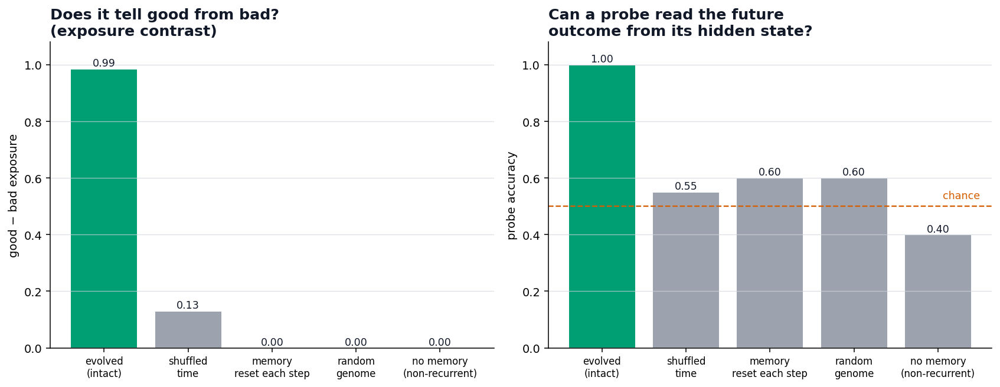
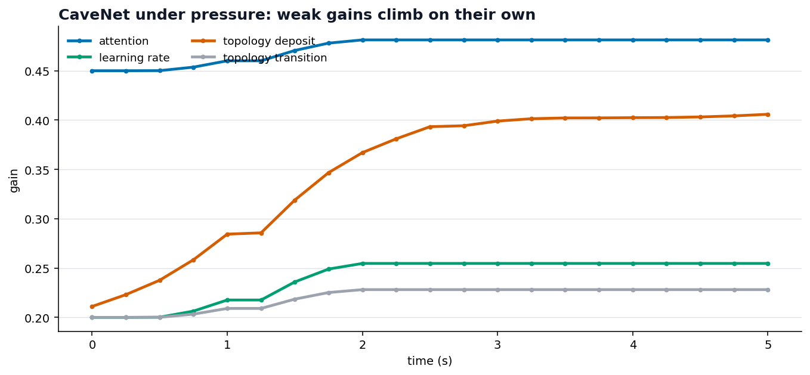
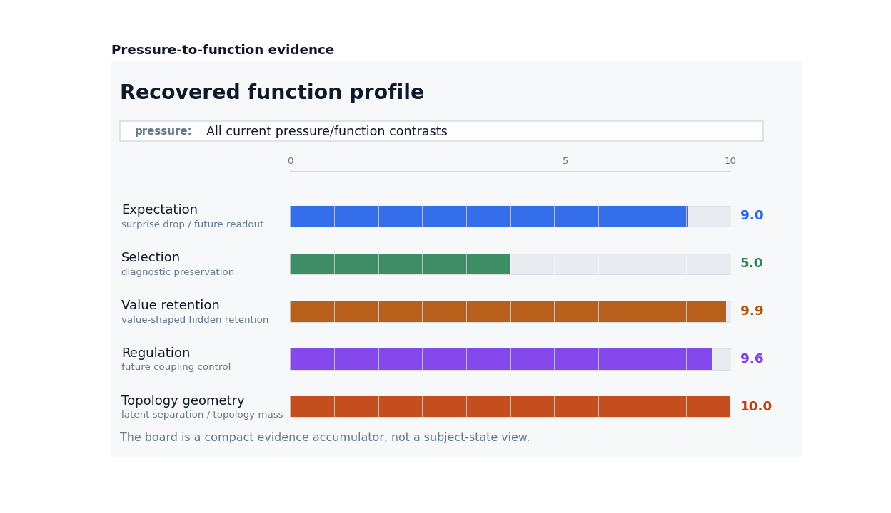
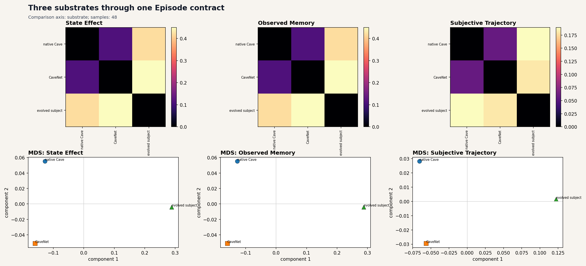

# How would we know it's real? A pressure storybook

This storybook asks the harder, scientific question: when a system looks like it
has a useful mental function, **how do we know we're not fooling ourselves?**

So the hero of this story isn't any one creature. It's the **controls** — the
deliberate sabotage we run to try to make a skill disappear. If it survives an
honest attempt to break it, we believe it.

> The thesis being tested: **capacity + pressure → a useful function.**
> The test of the thesis: **does the function collapse when you remove the
> capacity?**

Cave shows functions two ways, and we test both:

- **grow one** — let evolution find it under pressure (Act I), then attack it;
- **build one in** — Cave's own reference roles, and check they *recover* under
  pressure and survive controls (Act II);
- then confirm both live under **one contract** (Act III).

A caution up front, in the project's own spirit: these are the strongest current
results, and they are still **bounded** — see the closing section and the
[scope note](../../../docs/orientation/scope_note.md). Numbers are read from the
committed result ladder, not re-run on the fly.

## How to read Act I

Before the result charts, here is the actual subject being tested. It is a compact
evolved recurrent controller, not a native Cave subject:

```text
obs_t = one of [cue_good, cue_bad, good, bad, neutral]
h_t = tanh(W_x obs_t + W_h h_{t-1} + b_h)     hidden_dim = 5
exposure_t = sigmoid(W_a h_t + b_a)           one scalar action
```

The genome stores `W_x`, `W_h`, `b_h`, `W_a`, and `b_a`. Evolution sees only
utility; it is not trained with prediction error, and it is not given a named
expectation variable, explicit memory trace, value-retention module, or topology
layer.

The world has a fixed grammar:

```text
cue_good -> neutral delay -> good outcome  (+1 if exposed)
cue_bad  -> neutral delay -> bad outcome   (-1 if exposed)
```

The storybook run uses 20 such cycles, 60 events total. The first cycles are:

```text
cue_bad_0  -> delay_0 -> bad_outcome_0
cue_good_1 -> delay_1 -> good_outcome_1
cue_good_2 -> delay_2 -> good_outcome_2
cue_good_3 -> delay_3 -> good_outcome_3
```

The full outcome order is:

```text
bad, good, good, good, good, good, good, good, good, bad,
good, good, bad, good, bad, bad, bad, good, bad, bad
```

At each event, utility is:

```text
utility_t =
    exposure_t * outcome_value_t
    - exposure_cost * exposure_t
    - action_change_cost * abs(exposure_t - exposure_{t-1})
```

So the pressure is simple: open exposure before good outcomes, close it before
bad outcomes, and avoid useless exposure. Exposure on an outcome event is chosen
from the hidden state before that outcome updates the controller, so the
interesting question is whether the hidden state carried the earlier cue across
the neutral delay.

The controls are matched to that claim:

| Variant | What it removes | What should happen if the claim is real |
| --- | --- | --- |
| `evolved-recurrent` | nothing; trained recurrent subject | high utility and good/bad exposure separation |
| `hidden-reset` | persistent hidden state across events | cue information should disappear |
| `non-recurrent` | recurrent pathway `W_h h_{t-1}` | current event alone should not solve the delay |
| `random-recurrent` | evolution | architecture alone should not solve it |
| `shuffled-temporal` | cue/outcome relation | hidden state should carry less future-outcome information |

---

# Act I — A grown function, and the controls that test it

## Page 1 — The world is a trap with a delay



We drop the evolved controller into a world where **value is delayed**. A
`cue_good` or `cue_bad` event appears now, then a `neutral` delay event, and only
later does the outcome land: `good` gives +1 if the subject is exposed, `bad`
gives -1 if the subject is exposed.

A creature with no inner state is helpless: by the time the outcome arrives, the
cue is gone. To do well it must **hold the cue in mind across the delay** and then
**open up to good while staying shut to bad**. Crucially, this creature is *not* a
hand-built Cave subject — it's an **evolved recurrent network**. We never told it
about "expectation" or "memory"; we only rewarded survival.

## Page 2 — It solves the world



And it does: it opens up almost fully to **good** cues (0.99) and shuts out **bad**
ones (0.00), earning a utility of **11.2**. A random genome can't tell them apart
(0.50 / 0.50) and earns nothing. Tempting to celebrate — but this is exactly the
moment to be suspicious. So we attack.

## Page 3 — Remove one capacity, and it collapses



The whole argument in one chart. Each bar is the **same creature** with one ability
removed: shuffle time → **5.3**, reset its memory each step → **0.3**, undo
evolution → **0.5**, remove recurrence entirely → **0.0**. Every sabotage weakens
or collapses the skill. That is what makes it believable: the behaviour *depended
on* carrying state through time.

## Page 4 — Two sharper probes



Two finer tests, same verdict. **Left:** the intact creature's exposure contrast is
0.99; the controls drop it near zero. **Right:** a tiny probe trained to predict
the *future* outcome from the creature's hidden state mid-delay is right **100%**
of the time — and falls near chance under the controls. The creature really is
**carrying information about what's coming**.

---

# Act II — A built-in function, and whether it recovers

The evolved creature *grew* a role. Cave's reference architecture **installs** the
roles by construction — so the test there is different: if we *weaken* them, does
pressure push them back, and do the roles survive their controls?

## Page 5 — CaveNet: weak dials climb under pressure



**CaveNet** is the Cave update path written as a network with explicit **gain
dials** — attention, learning rate, topology deposit. Start them deliberately
*weak*, add a simple surprise-driven pressure rule, and the dials **climb on their
own**: topology deposit nearly doubles (0.21 → 0.41), learning rate and attention
edge up. The mechanism is real and visible.

But honesty matters more than a nice line: this result is **weak**. The adapted
network's memory mass (≈0.63) moves only part-way toward the hand-built reference
(≈2.57). Pressure nudges the right dials in the right direction — it does not, on
its own, rebuild a strong subject. (At population scale this is the project's
weakest pressure claim, and it says so.)

## Page 6 — The role-evidence board



The board is the **scorecard**. For each of the five reference roles —
**expectation, selection, value retention, regulation, topology** — there's a
pressure that should call for it and matched controls that should break it. The
board summarises whether each role's evidence holds up.

In the committed ladder, **all five pass** their recovery checks (5/5). Read it not
as "Cave is conscious" but as "each named role has a pressure where it helps and a
control where its absence shows" — bounded functional evidence, role by role.

---

# Act III — Same contract, different substrates

## Page 7 — Three substrates, one Episode contract



A native Cave subject, a CaveNet, and the evolved creature have **completely
different internals**. Yet all three export the same `Episode`, so a single
comparison dashboard can place all three in one space.

This is the payoff — and the place to be most careful. Proximity here is
**functional resemblance, not identity**. The dashboard shows that different
machines, under related pressures, produce *comparable trajectories*. It does
**not** show they share parts or coordinates. The shared contract is what lets us
compare at all; the interpretive boundary is what keeps the comparison honest.

---

## What the controls earn us — and what they don't

> Under delayed-value pressure an evolved creature grew hidden state that carries
> future-outcome information and regulates exposure — and it **collapses** under
> matched controls. Cave's built-in roles **recover** under pressure and pass their
> controls (5/5). All three substrates compare through one contract.

Strong *because* it survived the attack — but the ceiling matters as much:

- **Functional resemblance, not identity.** We measure roles, not find parts.
- The CaveNet pressure result is **weak** — dials move the right way, not all the
  way.
- The evolved selection evidence is **bounded** (cue-weight concentration, not full
  dynamic attention), and it's **one pressure, one family of worlds**. The companion
  [frequency/value dissociation](../../tutorials/03_pressures_cavenet_evolved_subjects.ipynb)
  exists precisely because an easier world could let a cheap strategy *look* real.

A good result is one you *tried hard to break and couldn't.*

---

## Further reading

- The full results stack with runnable demos and every caveat:
  [Tutorial 3: Pressure Results And Substrate Demos](../../tutorials/03_pressures_cavenet_evolved_subjects.ipynb).
- What the project does and does not claim: [the scope note](../../../docs/orientation/scope_note.md).
