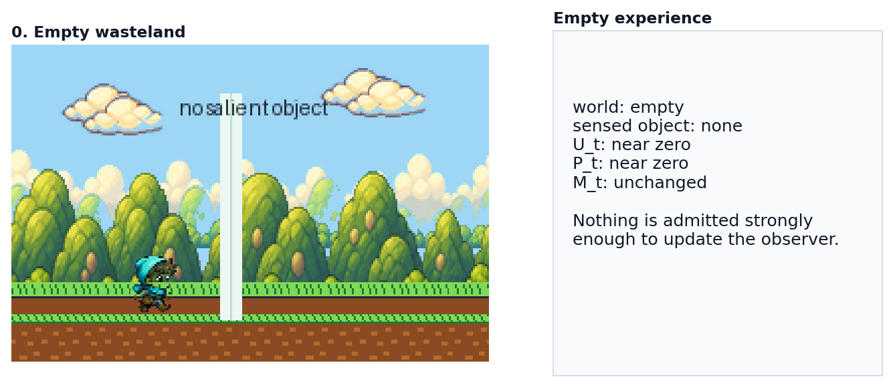
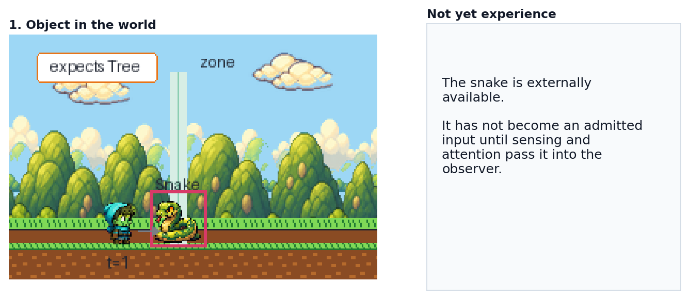
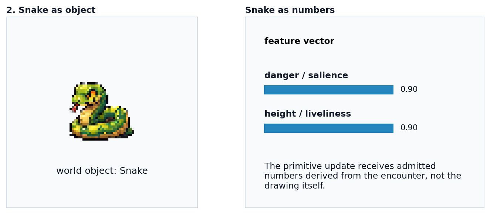
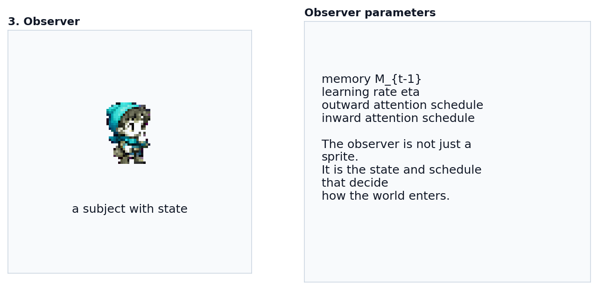
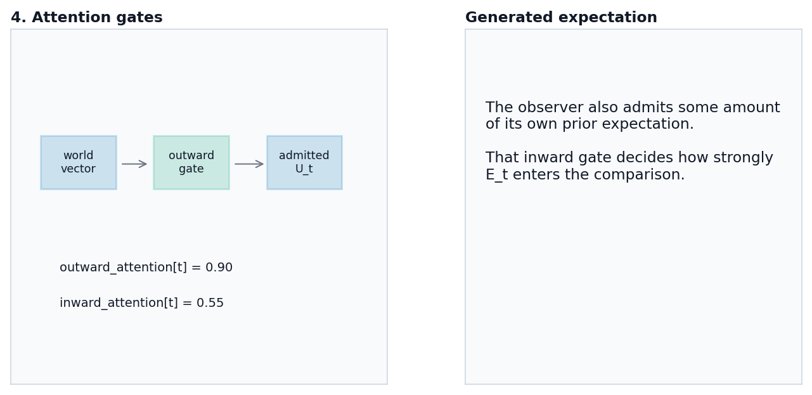
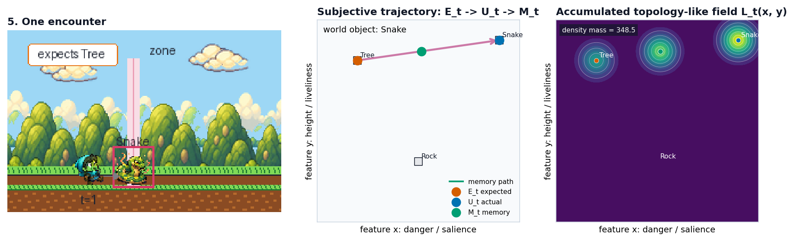
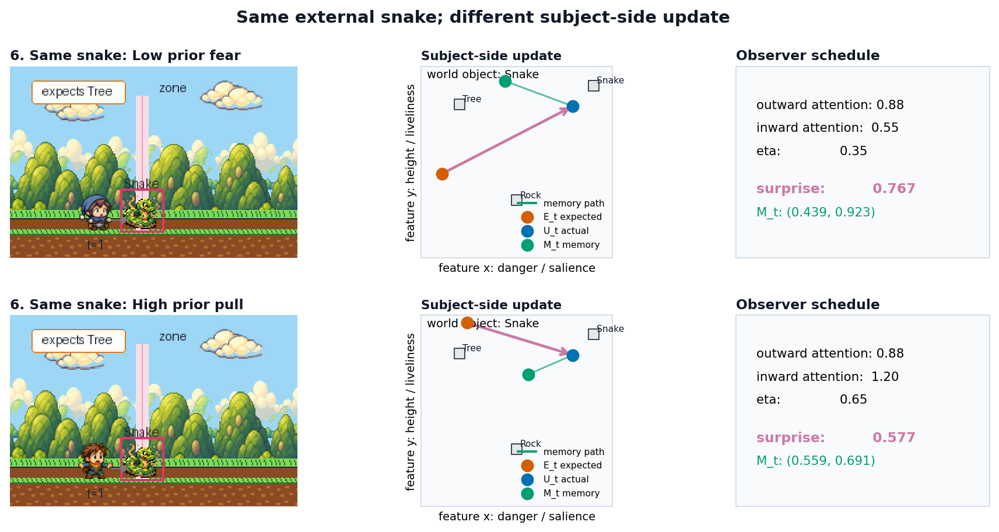
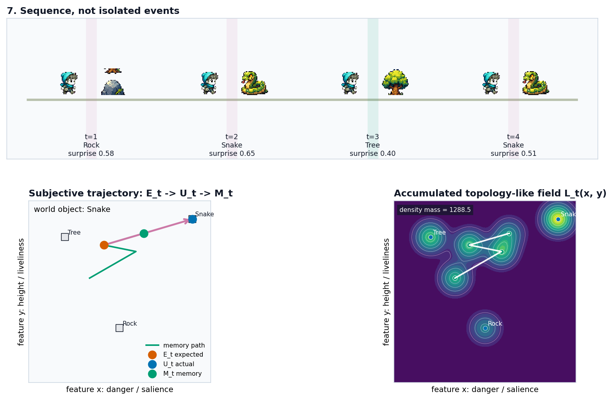

# Comprehensive Primitive Demo

This is a design note for a larger primitive-demo walkthrough that can live
beside the current storybook. The existing storybook starts at the recurrence:

```text
E_t = M_{t-1}
P_t = U_t - E_t
M_t = M_{t-1} + eta * P_t
```

The comprehensive demo should start one layer earlier: how something in the
world becomes an admitted experience for a particular observer.

The thesis:

```text
world episode
-> sensed object
-> attention-gated admitted input
-> comparison with generated expectation
-> error
-> memory update
-> subject-side trajectory
-> accumulated topology
```

The primitive storybook shows the heartbeat. This walkthrough shows why the
body around that heartbeat matters.

The first asset pass is generated by:

```bash
python notebooks/demos/primitive_demo/scripts/generate_comprehensive_demo.py
```

## Demo Shape

Use a scrolling wasteland as the first visual anchor. The world should feel
quiet and legible: a ground plane, horizon, a small observer, and long stretches
where nothing salient is present.

The demo should avoid introducing the full Cave vocabulary up front. Each layer
appears only after the viewer has seen what problem it solves.

## 0. Empty Wasteland

Show the observer moving through an empty scene.



Caption:

```text
This is an empty experience.
```

Clarification:

```text
Nothing is admitted strongly enough to update the observer.
```

Visible state:

```text
world: empty
sensed object: none
admitted input U_t: near zero
expectation E_t: prior memory
error P_t: near zero
memory M_t: unchanged
topology field: quiet
```

Purpose: establish that a world can exist without producing a meaningful
subject-side event.

## 1. Object In The World

A snake enters the scrolling wasteland.



Caption:

```text
This is not yet an experience. It is only something in the world.
```

The snake should be visibly present before it becomes a vector or update. This
keeps the world/event distinction clear:

```text
world object != admitted input
```

Purpose: separate external availability from subject-side uptake.

## 2. Object Becomes Numbers

Freeze briefly and translate the snake into a feature vector.



Example:

```text
snake = {
  danger: 0.92,
  motion: 0.86,
  angularity: 0.78,
  novelty: 0.95
}
```

The exact feature names should match whichever primitive feature vocabulary the
implementation uses. The important visual is the pairing:

```text
snake sprite -> snake vector
```

Purpose: make representation explicit. Cave is not updating from the drawing of
a snake. It is updating from admitted numbers derived from the encounter.

## 3. The Observer

Introduce the observer as a subject with parameters, not just a sprite.



Minimal observer card:

```text
observer:
  memory M_{t-1}
  outward attention schedule
  inward attention schedule
  learning rate eta
```

The card should stay plain and functional. It is a control/readout surface, not
a character biography.

Purpose: show that the same world object can pass through different subject
conditions.

## 4. Attention Gates

Split attention into two gates:



```text
outward attention = how strongly the sensed world enters as U_t
inward attention = how strongly generated expectation enters as E_t
```

For the first version, these can be scalar schedules over time:

```text
outward_attention[t] = 0.90
inward_attention[t] = 0.40
```

Then:

```text
U_t = outward_attention[t] * sensed_vector
E_t = inward_attention[t] * generated_expectation
```

If the implementation keeps the primitive recurrence exactly as-is, this section
can be framed as the conceptual bridge to full Cave rather than as a changed
kernel. In that case:

```text
primitive demo: U_t is already admitted
fuller demo: attention explains how U_t becomes admitted
```

Purpose: make the transition from primitive Cave to fuller Cave explicit without
burying the viewer in the complete architecture.

## 5. One Encounter

Run one snake encounter end to end.



Panels:

```text
left: scrolling world with snake
middle: vector/update geometry
right: topology deposit
bottom: compact tape of numbers
```

Update:

```text
generated expectation: E_t
attended input:        U_t
prediction error:      P_t = U_t - E_t
memory update:         M_t = M_{t-1} + eta * P_t
```

The visual grammar should match the existing storybook:

```text
orange: expectation E_t
blue: actual/admitted input U_t
pink: error P_t
green: updated memory M_t
```

Purpose: connect the more comprehensive setup back to the primitive recurrence.

## 6. Same Snake, Different Observer

Replay the same external snake for two observers.



Example contrast:

```text
Observer A:
  high outward attention
  low inward fear expectation
  moderate eta

Observer B:
  moderate outward attention
  high inward fear expectation
  high eta
```

The world strip should remain identical. Only the subject-side panels change.

Caption:

```text
Same snake. Different admitted input, different error, different memory.
```

Purpose: this is the main Cave claim in a compact form. The external episode is
shared; the subject-side trajectory is not.

## 7. Sequence, Not Event

Scroll through a short episode:



```text
empty -> rock -> snake -> tree -> snake
```

Show the observer carrying each update forward. The second snake should not be
treated as the first snake repeated from a blank state.

Caption:

```text
The next snake is not the first snake. The observer carries the prior walk into it.
```

Purpose: make history dependence impossible to miss.

## 8. Topology Trace

Reveal the accumulated topology only after the trajectory is understood.

Caption:

```text
The topology is not the experience itself. It is the trace left by repeated
expectation, input, error, and memory.
```

Recommended comparison:

```text
ordered trajectory: S_1 -> S_2 -> ... -> S_T
accumulated field: density deposited from that history
```

Purpose: preserve the existing primitive distinction between trajectory and
field, while showing why the field becomes useful after repeated experience.

## 9. Full-Stack Bridge

Close by showing what the primitive demo includes and what full Cave adds.

```text
primitive recurrence:
  admitted input -> expectation -> error -> update

comprehensive primitive demo:
  world object -> attention-gated input -> recurrence -> topology trace

full Cave:
  exposure, sensing, attention, value, memory, workspace compression,
  topology, views, comparison
```

Purpose: keep the demo honest. This is not the full Cave system, but it is the
smallest walkthrough that shows why full Cave needs more than the recurrence.

## Implementation Notes

This can be built incrementally.

First target:

```text
static markdown storyboard with generated still panels
```

Second target:

```text
generated still panels using the existing Cave Walker renderer
```

Third target:

```text
HTML walkthrough with scroll/step controls and synchronized readouts
```

Generated assets:

```text
notebooks/demos/primitive_demo/assets/comprehensive/00_empty_wasteland.png
notebooks/demos/primitive_demo/assets/comprehensive/01_object_in_world.png
notebooks/demos/primitive_demo/assets/comprehensive/02_object_becomes_numbers.png
notebooks/demos/primitive_demo/assets/comprehensive/03_observer.png
notebooks/demos/primitive_demo/assets/comprehensive/04_attention_gates.png
notebooks/demos/primitive_demo/assets/comprehensive/05_one_encounter.png
notebooks/demos/primitive_demo/assets/comprehensive/06_same_snake_different_observers.png
notebooks/demos/primitive_demo/assets/comprehensive/07_sequence_topology.png
```

Regenerate them from the repository root:

```bash
python notebooks/demos/primitive_demo/scripts/generate_comprehensive_demo.py
```

The implementation reuses the existing primitive colors, object vocabulary,
sprites, internal map, and topology panel wherever possible. New machinery is
introduced only where the current primitive storybook cannot express the
world-to-admitted-input step.
