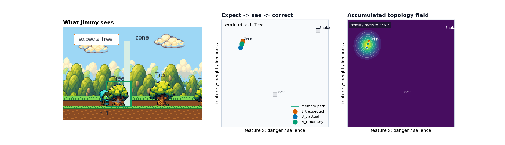
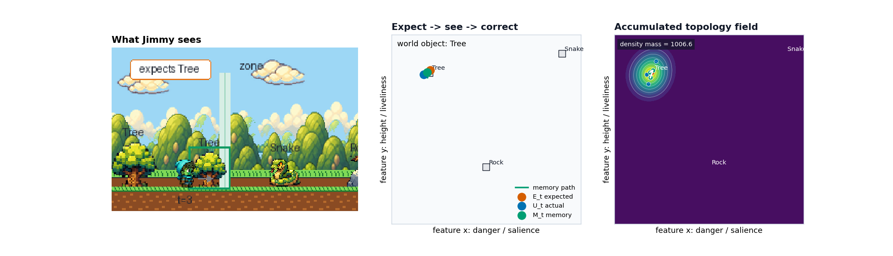
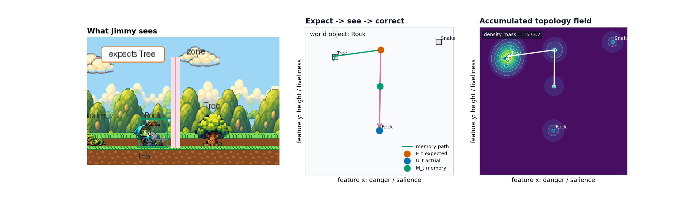
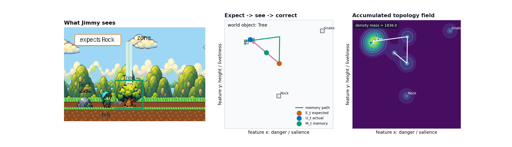
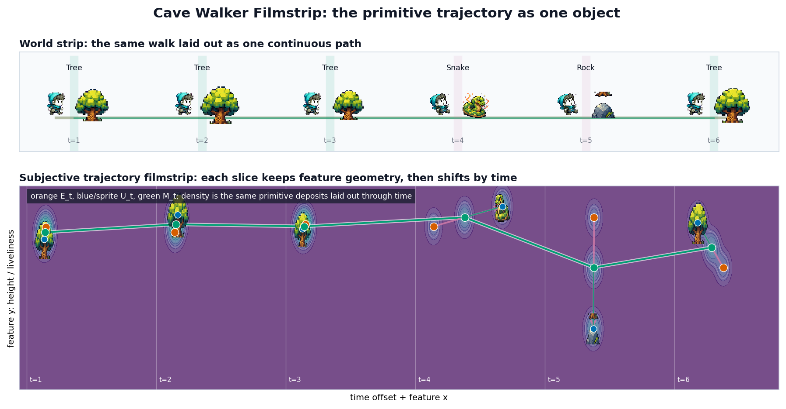

# Jimmy and the Snake: a Cave storybook

This is the gentlest possible version of what Cave does. A little fellow named
**Jimmy** walks down a path, meets things, and quietly changes his mind. Jimmy is
here so you can *feel* the idea — but on every page we also show the **actual
vectors and arithmetic**, because that loop of arithmetic is the real thing Cave
runs.

Each page has three pictures:

- **What Jimmy sees** — the world he's walking through.
- **Expect → see → correct** — a flat map of "what kind of thing is this?"
  Left-to-right is *how dangerous / attention-grabbing*; up-and-down is *how
  tall and lively*. Every object has a fixed spot (Tree, Rock, Snake).
- **Accumulated topology field** — a heat-map that builds up *over the whole
  walk*. It is **not** Jimmy's current thought; it's the trail left behind by
  everywhere his expecting / seeing / remembering has been. Bright = visited
  often.

On the middle map, watch three colored dots:

| Dot | Symbol | Meaning |
| --- | --- | --- |
| 🟠 **orange** | `E_t` | generated input: what Jimmy **expected** from prior memory |
| 🔵 **blue** | `U_t` | sensed input: what he **actually** saw |
| 🟢 **green** | `M_t` | what he now **remembers** |
| pink arrow | `P_t` | the **error / surprise** — sensed input minus generated input |

## The whole loop, in four lines

At every step Jimmy does exactly this:

```text
E_t = M_{t-1}                  generated input from prior memory
U_t = sensed world input       what actually arrives
P_t = U_t - E_t                error: sensed minus generated
surprise = |P_t|               how big that miss was
M_t = M_{t-1} + η · P_t        memory steps toward the actual   (η = 0.45)
```

Here is the one fact that makes the middle picture click. Because `E_t` *is* the
previous memory, the update simplifies to:

```text
M_t = E_t + η · P_t            memory lands a fraction η along the arrow
```

So the green dot always sits **exactly 45% of the way** down the pink arrow, from
orange (expected) to blue (actual). That 45% *is* η. Learning, made geometric:
**expect, see how wrong you were, then close 45% of the gap.** This is what Cave
calls the *correction* — and the green "memory path" you see growing is the
trajectory of corrections.

Notice what the orange dot really is. Jimmy didn't read his expectation off the
world — he **generated** it from his own prior memory (`E_t = M_{t-1}`). It is
*derivative*: it comes from his state, not from the new object in front of him.
But it is still **objective** — fix the starting memory and η, and every orange
dot is a fixed point you can plot, subtract, and measure against. That is the
quiet move underneath the whole loop: a signal the subject made about itself,
sitting on the same map as the world, ready to be compared.

---

## Page 1 — A tree



Jimmy starts out expecting a tree, because trees are all he's known. He walks up
and — yes — it's a tree. His guess was nearly right, so almost nothing happens:
on the map the three dots sit on top of each other, the arrow is a speck.

```text
E_t = (0.200, 0.800)        (his starting tree-prior)
U_t = (0.180, 0.740)
P_t = (-0.020, -0.060)      surprise = 0.063   ← tiny
M_t = E_t + 0.45·P_t = (0.191, 0.773)
```

In the topology field, a single soft bloom starts forming over "Tree." That
bloom is the *deposit* — the first mark of a trail.

---

## Page 2 — Another tree


Another tree, a little taller and different — trees aren't identical — so Jimmy
is *slightly* off. A small arrow; memory nudges to settle in the middle of
"tree-ness."

```text
E_t = (0.191, 0.773)
U_t = (0.220, 0.860)
P_t = (+0.029, +0.087)      surprise = 0.092
M_t = (0.204, 0.812)        = E_t + 0.45·P_t
```

The Tree bloom in the field grows brighter — same spot visited twice.

---

## Page 3 — A third tree



Tree again. Jimmy barely blinks — the smallest arrow yet. His memory is now
parked firmly at "Tree," and "Tree" is exactly what he expects next.

```text
E_t = (0.204, 0.812)
U_t = (0.170, 0.790)
P_t = (-0.034, -0.022)      surprise = 0.041   ← smallest of the walk
M_t = (0.189, 0.802)
```

This is the calm before the turn. The field now has one dominant, bright
Tree-hill and almost nothing elsewhere.

---

## Page 4 — A SNAKE!


Jimmy strolls up still expecting a tree (see his thought bubble) — and instead
there's a **snake**: dangerous and lively, in the far corner from where he was
looking. Look at the arrow now — it stretches all the way across. This is the
biggest surprise of the walk.

```text
E_t = (0.189, 0.802)        he expected a tree
U_t = (0.900, 0.900)        he got a snake
P_t = (+0.711, +0.098)      surprise = 0.718   ← huge
M_t = (0.509, 0.846)        = E_t + 0.45·P_t
```

The correction is still just "close 45% of the gap" — but the gap is enormous,
so memory **lurches** from `0.19` to `0.51` along the danger axis in one step. He
doesn't forget trees entirely from one fright; he moves 45% of the way and walks
on. In the field, a new trail streaks out of the Tree-hill toward the snake's
corner.

And here is the subtle part: the snake didn't *set* this surprise — the **gap**
did. `P_t` is the distance between two signals, the admitted snake and the
generated tree-expectation. Give Jimmy a different prior and the very same snake
produces a different `P_t`. Surprise is a **relation**, not a property of the
thing in the corner.

---

## Page 5 — A rock



After the snake, Jimmy is rattled. Look at the orange dot: his expectation has
been dragged *up* toward "tall and lively" — not a full snake, but no longer the
calm low tree he'd have guessed yesterday. Then it's a plain, low rock:
surprising again, but in the **opposite** direction. The arrow points down.

```text
E_t = (0.509, 0.846)        dragged up by the snake
U_t = (0.500, 0.300)        a calm, low rock
P_t = (-0.009, -0.546)      surprise = 0.546   ← big, mostly downward
M_t = (0.505, 0.600)        memory slides down the middle
```

The lesson the numbers make exact: **his surprise depends on what he just went
through.** The identical rock would have produced a smaller `P_t` if his
expectation hadn't been lifted by the snake first.

---

## Page 6 — Home again, a tree



Finally a tree again — back where the walk began. Jimmy is *still* a little
surprised by it, because his memory is carrying the snake and the rock.

```text
E_t = (0.505, 0.600)        a "middling, careful" expectation
U_t = (0.240, 0.820)        an ordinary tree
P_t = (-0.265, +0.220)      surprise = 0.344
M_t = (0.386, 0.699)        drifting back toward Tree, not yet home
```

The green memory path on the map traces the whole journey — parked at Tree, flung
toward Snake, dropped toward Rock, now drifting home. And the topology field is a
quiet record of all of it: a brilliant Tree-hill, a faint snake mark, a small
rock mark, and the corrections strung between them (`density mass = 1836`).

He didn't *reset*. He was **shaped by the trip**. A few more trees and he'd
settle back to tree-confidence — carrying a faint memory that snakes exist.

---

## That's the idea — and it's literally the arithmetic

Strip away the sprites and Jimmy ran the same four lines at every step:

> **`E_t = M_{t-1}` · `P_t = U_t − E_t` · `M_t = M_{t-1} + η·P_t`**

Here is the whole walk as a single picture — time runs left-to-right, and each
slice keeps the same feature map you saw on every page, just shifted along in
time:



Read it like a strip of film. On top, the world Jimmy walked: tree, tree, tree,
**snake**, rock, tree. Below, his subjective trajectory unrolled — at each slice
the orange `E_t`, the blue `U_t`, and the green `M_t`, with the pink error arrow
between them. The green memory path threads the whole journey in one line:
parked at Tree, flung toward Snake, dropped toward Rock, drifting home. The big
arrow at the snake is the big surprise; the tiny ones at the early trees are the
calm. It is every page at once.

Three things to take away, each visible in a panel:

1. **Expectation and correction** (middle panel). Jimmy's expectation is just his
   last memory, and each step closes a fixed fraction η of the gap to what
   actually arrived. The green path is the trajectory of those corrections.
2. **Topology** (right panel). The bright field is *downstream* of the
   trajectory — a trail deposited by where Jimmy's expecting/seeing/remembering
   went, not the trajectory itself. Visit a region often and it glows; the
   corrections between regions leave faint bridges.
3. **History matters.** The same rock surprised Jimmy more *because* of the snake
   before it. A different walker down the same path would end with different
   numbers — and watching exactly that is what Cave is for.

Real Cave wraps more around this kernel — Jimmy's *senses* decide what even gets
in, his *attention* decides how strongly, value and exposure decide what he seeks
or avoids — but the heartbeat underneath is the four lines above. In full Cave
the two inputs to the gap each arrive through a gate: **outward attention** sets
how strongly the sensed world enters as `U_t`, and **inward attention** sets how
strongly the subject's own generated expectation enters as `E_t`. That is why two
subjects can walk the *same* path and end with different numbers — not only
because they see with different strength, but because they admit different
amounts of their own generated expectation into the comparison.

- For the same story with a running tape and the abstract 2-D demo, see
  [walkthrough.md](walkthrough.md).
- For the full system traced with real nine-dimensional vectors — including the
  topology *correction geometry* (expected/actual/after points) — see
  [the update loop walkthrough](../../../../docs/architecture/update_loop_walkthrough.md).

---

## Give Jimmy a different walk

This walk (tree, tree, tree, snake, rock, tree) is just one of infinitely many.
You can send Jimmy down a fresh, randomly generated path — any mix of trees,
rocks, and snakes — and get back a full picture-book with captions and the real
numbers, all from the same loop:

```bash
python notebooks/demos/primitive_demo/scripts/generate_storybook.py --random --seed 7 --length 8
```

That writes pages plus an auto-written `scenario.md` into
`notebooks/demos/primitive_demo/generated/scenarios/seed_7/`. Change `--seed` for a different
world, `--length` for a longer walk. Each one is reproducible from its seed, and
each shows the same thing this story shows: expect, see, measure the surprise,
correct — and watch the surprise at each step depend on everything that came
before it.
