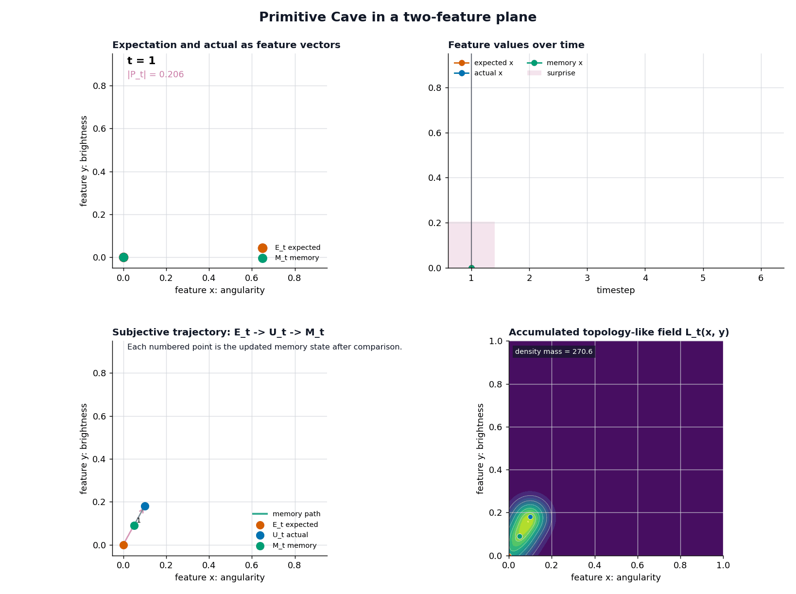
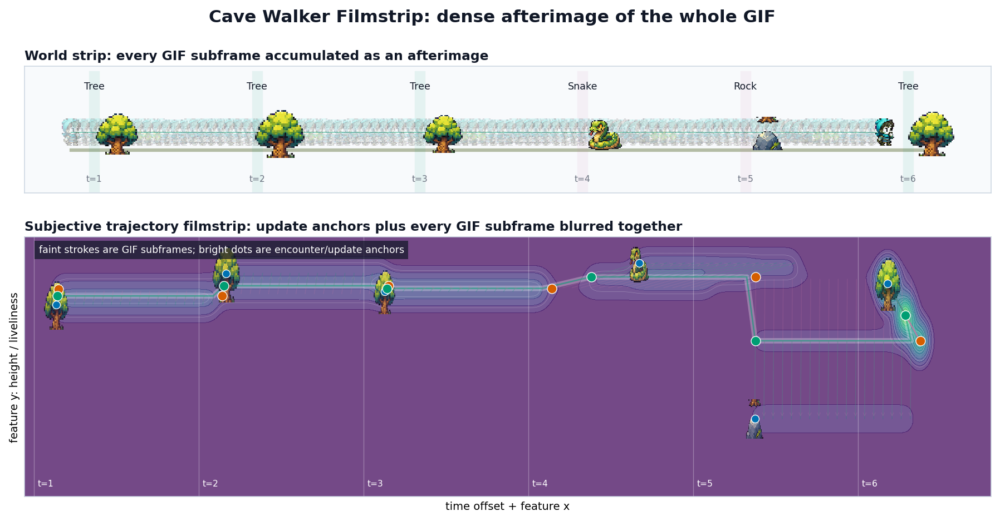

# Primitive Demo Walkthrough

This folder is the smallest visible version of Cave.

The full Cave system has many layers: world objects, exposure, sensing,
attention, expectation, error, memory, value, workspace compression, topology,
views, and comparison. The primitive demo strips that down to the first loop
that can still produce a subject-side trajectory.

```text
admitted input -> expectation -> error -> update -> next expectation
```

That loop is the point of the demo.

## The Primitive Loop

At each timestep, the primitive system carries one state forward as memory.
That memory becomes the next expectation. The actual admitted input arrives.
The mismatch becomes prediction error. Memory moves toward the actual input.

```text
E_t = M_{t-1}
P_t = U_t - E_t
M_t = M_{t-1} + eta * P_t
```

Where:

| Symbol | Meaning |
|---|---|
| `U_t` | actual admitted input |
| `E_t` | expectation from prior memory |
| `P_t` | prediction error |
| `M_t` | updated memory |
| `eta` | learning/update rate |

The minimal primitive state is:

```text
S_t = (U_t, E_t, P_t, M_t)
```

The primitive trajectory is the ordered history:

```text
S_1 -> S_2 -> ... -> S_T
```

This is why the trajectory is not just memory. Memory is one projection of the
trajectory. The full state history includes what was expected, what arrived,
how wrong the expectation was, and how memory changed.

## The Abstract Demo

The abstract demo shows the recurrence directly in a two-feature plane.



The top-left panel shows the current expectation, actual input, prediction
error, and updated memory. The top-right panel keeps a running tape. The bottom
left panel shows the subjective trajectory as points and arrows. The bottom
right panel accumulates a topology-like field from the same sequence.

That accumulated field is not the trajectory itself. It is a deposit made from
the trajectory:

```text
trajectory = ordered state history
field = accumulated trace of that history
```

This distinction matters because the full Cave system also has topology-like
state, but topology is downstream of subject-side history. The primitive demo
makes that dependency visible.

## The Walker Demo

Cave Walker wraps the same recurrence in a tiny object world.

```text
world object -> feature vector -> primitive update -> rendered subject state
```

The current episode is:

```text
tree -> tree -> tree -> snake -> rock -> tree
```

The subject starts with a tree-like prior. The early tree encounters are not
identical: each tree has a small visual and feature variation, so the subject
receives slightly different tree-like inputs rather than the same exact vector
each time. The snake then creates a much larger prediction error.


The side-scroller is not a separate model. It is an intuition layer over the
same primitive recurrence:

```text
expected object-like state
actual encountered object
error from mismatch
memory update
changed expectation for the next encounter
```

The world path is:

```text
tree -> tree -> tree -> snake -> rock -> tree
```

The subject-side trajectory is:

```text
S_1 -> S_2 -> S_3 -> S_4 -> S_5 -> S_6
```

Those are different things. The world sequence is what is available in the
episode. The primitive trajectory is what happens inside the subject once those
objects are admitted as inputs.

## The Filmstrip View

The GIF shows the walk one encounter at a time. The filmstrip shows the same
walk as a single static object: time runs left-to-right, and each slice keeps
the two-feature geometry intact while shifting along the time axis.


The top strip is the world path; the bottom strip is the subjective trajectory
unrolled. At each slice the orange `E_t`, blue `U_t`, and green `M_t` sit in
their feature positions, the pink arrow is the error `P_t`, and the green line
threads the memory path through the whole sequence. This is the trajectory made
legible without animation — the same `S_1 -> ... -> S_T` history, flattened into
one frame.

The blur variant accumulates every GIF subframe between the encounter anchors,
so the continuous motion between updates becomes a dense afterimage:



The bright dots are the encounter/update anchors; the faint strokes are the
in-between subframes. Both filmstrips are the same primitive deposits the
accumulated field is built from — just laid out through time instead of summed
into one plane.

## Why This Sits Below Full Cave

Primitive Cave starts after input has already been admitted.

That is a deliberate simplification. It does not explain how exposure, sensing,
attention, or value decide what gets admitted. It does not model a full subject
profile, multiple view boundaries, or comparison across subjects.

The full Cave system sits around this kernel:

```text
world object
-> exposure
-> sensing
-> attention
-> admitted input
-> expectation
-> error
-> update
-> changed future uptake
```

So the relationship is:

```text
Primitive Cave = minimal trajectory generator
Full Cave = complete subject-side architecture
```

Primitive Cave shows how a subject-side trajectory can form at all. Full Cave
explains why different subjects form different trajectories from the same
external episode.

## Running The Demos

From the repository root:

```bash
python notebooks/demos/primitive_demo/primitive_cave/primitive_demo.py
python notebooks/demos/primitive_demo/cave_walker/cave_walker_demo.py
```

The scripts write generated frames, rollout data, and GIFs into each demo's
`out/` directory. The two GIFs embedded in this walkthrough are checked-in
copies of representative outputs so the explanation can be read without running
the scripts first.

## Files

```text
kernel/primitive_engine.py
  Shared recurrence kernel.

primitive_cave/primitive_demo.py
  Abstract 1D and 2D visualizations of the primitive loop.

cave_walker/cave_walker_objects.py
  Object definitions, episode, tree variants, and object-to-feature mapping.

cave_walker/cave_walker_demo.py
  Side-scroller renderer plus HUD, trajectory map, and topology panel.

../assets/primitive_loop_2d.gif
  Checked-in abstract recurrence walkthrough.

../assets/cave_walker.gif
  Checked-in object-world walkthrough.
```

