# Ten ways to be wrong on purpose: a Cave scenarios storybook

This storybook follows the **probes**. Cave ships a set of *canonical causal
probes*: tiny, authored worlds each built to make **one** distinction
inspectable, and to fail loudly if the model doesn't actually implement that
distinction.

A probe is not a theory. It's a controlled question, written the same way every
time:

> **hypothesis → control → expected contrast → observed contrast → interpretation**

Every probe runs on the same machinery as everything else (`external sequence +
subject + per-step update → episode`), and every probe carries an executable
`check` that asserts its expected contrast. The panels are generated from those
checks, and the quoted numbers below are copied from the same checked metrics; if
the machinery changes, the checks are the source of truth.

## How to read a probe

Each page has the same anatomy:

```text
fixture or synthetic sequence
    + subject configuration
    + CaveProducer / pressure-test runner
    -> Episode
    -> check_* metrics
    -> storybook panel
```

The external world is deliberately tiny. What changes from page to page is the
one subject-side knob needed to isolate the relation:

| Page | Source | Subject knob or control | What the check reads |
| --- | --- | --- | --- |
| 1. Unseen modality | `artifacts/inputs/cave/scenarios/unseen_modality.json` | visual-only sensorium | audio exists externally but contributes zero actual input |
| 2. Attention bottleneck | `artifacts/inputs/cave/scenarios/attention_bottleneck.json` | visual/audio sensors with channel weights `0.25/0.75` | actual input and attention weights match the channel allocation |
| 3. Compression | `artifacts/inputs/cave/scenarios/representational_compression.json` | top-1 workspace compressor | attended detail exists, but actual state keeps only the dominant feature |
| 4. Violation | `artifacts/inputs/cave/scenarios/expectation_violation.json` | surprise-weighted learning over repeats and anomaly | surprise falls on repeats and spikes on the violation |
| 5. Importance | `artifacts/inputs/cave/scenarios/importance_weighted_event.json` | event `learning_weight` | learning rate, memory movement, and attention strength increase together |
| 6. Valence | `artifacts/inputs/cave/scenarios/valence_attractor_repulsor.json` | metadata valence evaluator plus objective evaluator | pain, pleasure, utility, and surprise stay separable |
| 7. Objective shift | `artifacts/inputs/cave/scenarios/objective_attention_shift.json` | objective-adaptive attention policy | painful audio changes the next channel distribution |
| 8. Preference emergence | pressure-test runner | memory/preference controls | skill rises only when the responsible capacities are present |
| 9. Role dependency | synthetic control episodes | positive, passive, random, and cosmetic-topology controls | each fake preserves only the dependencies it actually implements |
| 10. Topology atlas | generated scenario/control episodes | shared flat topology prior for every row | each probe leaves a different trajectory footprint under one lens |

The pictures are therefore not ten unrelated demos. They are ten small
interventions over the same contract: authored inputs go through a configured
subject, the run becomes an `Episode`, and a `check_*` function reads whether the
intended relation really appeared.

The ten probes group into four questions:

- **Act I — what gets *in*?** The boundary between being present in the world and
  entering the subject's state.
- **Act II — what does prediction *cost*?** Why expectation is computed before
  memory moves, and how importance rides one shared rule.
- **Act III — what does *value* steer?** Affect as evaluated state, separate from
  surprise, and able to bend future attention.
- **Act IV — does it *survive controls*?** Skill emerging under pressure, and the
  contrasts that say which roles are real.

---

# Act I — The gate: presence is not entry

## Page 1 — An object you cannot sense

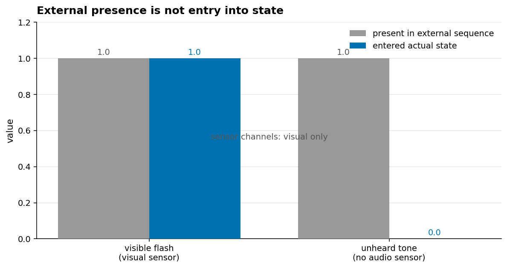

Two objects, both fully present in the external sequence: a **visible flash** and
an **audio tone**. The subject has a visual sensor and no audio sensor. The
flash enters its state at full strength (**1.0**); the tone never enters at all
(**0.0**), because there is no channel to carry it. Its sensor channels are
**visual only**.

> **The distinction:** existing in the world and entering a mind are different
> events. An unsensed object can sit in the external timeline forever and leave
> memory, prediction, and topology completely untouched.

## Page 2 — Two objects, one narrow channel

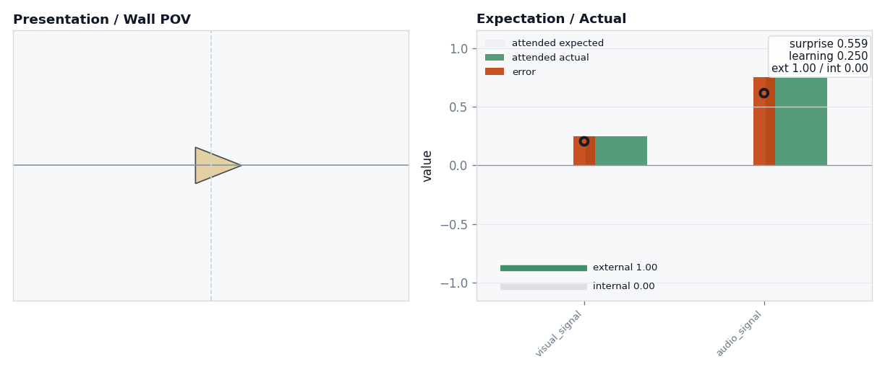

Now both objects *can* be sensed — a visual marker and an audio marker arrive at
the same instant — but attention is allocated **0.25 to visual, 0.75 to audio**.
The actual input that lands in state is exactly **[0.25, 0.75]**: the attended
channel dominates. Change the channel weights and the internal result changes
*without touching the external world at all*.

> **The distinction:** between what is *present* and what *passes through the
> attention bottleneck*. Attention is a budget spent on channels, and the budget
> shows up directly in the attended vector.

## Page 3 — Detail lost after attention

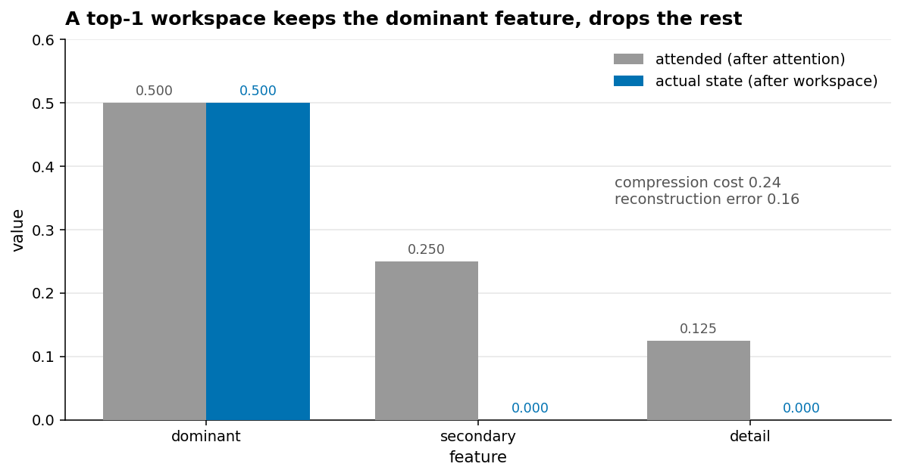

A signal can clear attention and *still* lose detail. Here a three-feature input
`[0.5, 0.25, 0.125]` passes attention intact, then goes through a **top-1
workspace** before prediction and memory. Only the **dominant** feature survives;
secondary and detail are zeroed. The episode records a **compression cost of
0.24** and a **reconstruction error of 0.16**.

> **The distinction:** present-time attention and representational compression are
> two separate bottlenecks. Something can be attended and *then* discarded before
> it becomes the state used to predict and remember.

---

# Act II — Prediction and learning

## Page 4 — Expectation has a history; violation has a cost

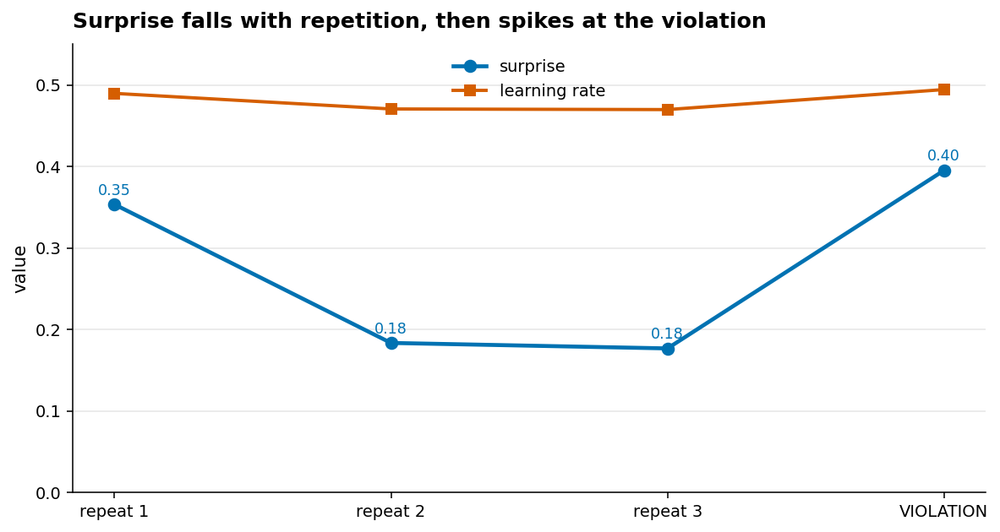

Three identical inputs, then one anomaly on the other feature axis. Surprise
**falls** as memory learns the pattern (**0.35 → 0.18 → 0.18**), then **spikes to
0.40** when the violation lands. Because this subject uses surprise-weighted
learning, the violation also nudges the **learning rate up** (0.494 vs 0.470 on
the last repeat) — it learns *faster* exactly when it's most wrong.

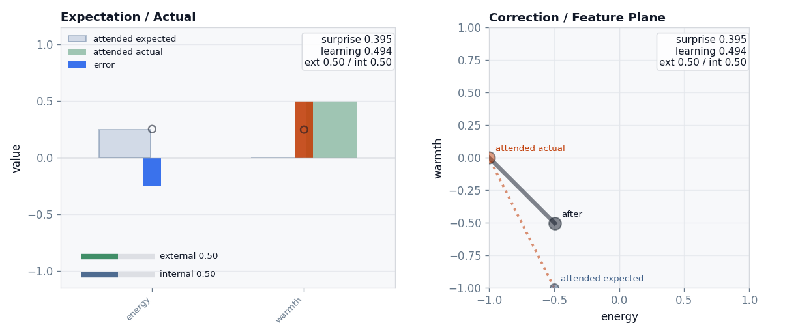

The same instant as geometry. The **expected** point still sits where the learned
pattern was (`energy` axis, lower-left); the **actual** input has leapt onto the
`warmth` axis; the **after** point lands between them — memory corrected toward
the surprise, but only by the learning rate. This is why expectation must be read
*before* the update: it's the thing the world is about to violate.

> **The distinction:** prediction error is history-dependent. The same anomaly is
> only surprising *because* of what came before it.

## Page 5 — Importance without categories

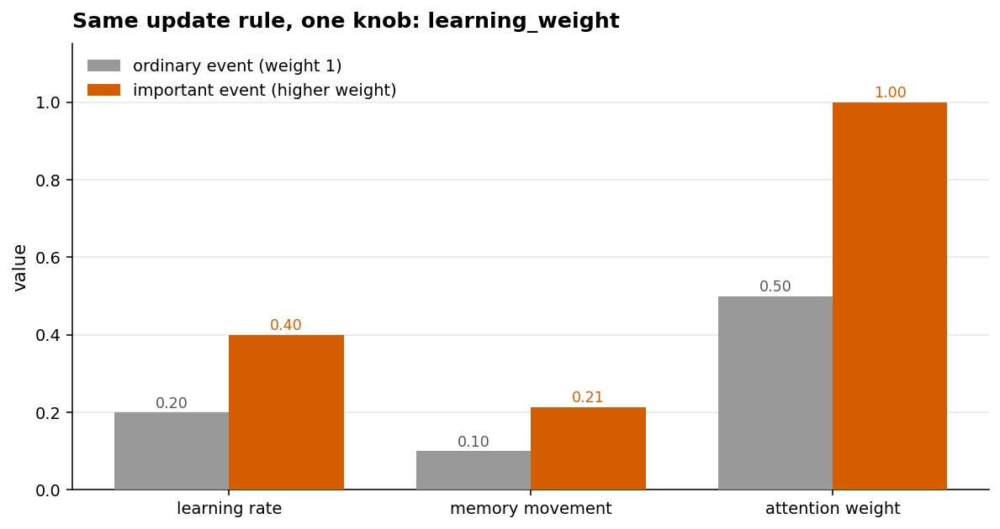

Two otherwise-identical events, differing only in `learning_weight`. The important
one earns a higher **learning rate** (0.40 vs 0.20), moves **memory** more than
twice as far (0.21 vs 0.10), and draws full **attention** (1.0 vs 0.5) — all
through the *same* update rule. There is no special "important event" code path.

> **The distinction:** salience can be a parameter on a shared mechanism, not a
> hard-coded category. Important events look different because one knob is turned,
> not because the model branches.

---

# Act III — Value steering

## Page 6 — Affect is its own state

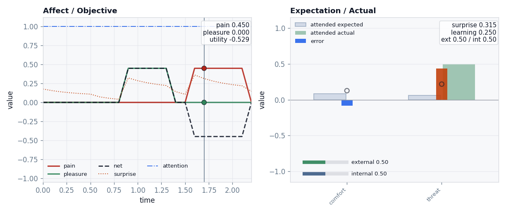

Three events carry authored affect metadata: neutral, pleasant, painful. The
affect trace shows **pleasure rising to 0.45** at the pleasant event and **pain to
0.45** at the painful one, with net valence swinging **+0.45 then −0.45** — while
surprise (the dotted line) runs on its *own* schedule underneath.

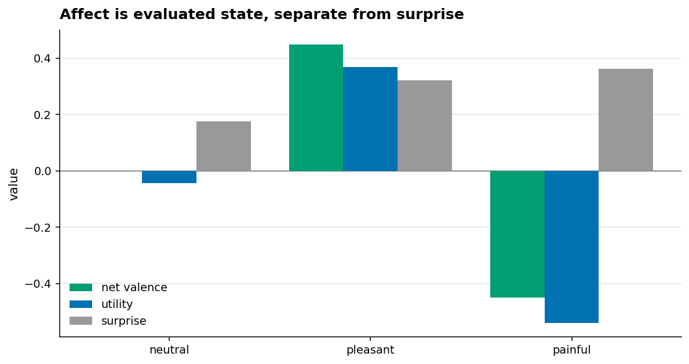

Side by side: the **neutral** event has zero net valence but is still
**surprising (0.18)**; the **pleasant** event is positive on valence *and* utility
(+0.45 / +0.37); the **painful** one is negative (−0.45 / −0.54) — yet all three
carry real surprise. Surprise and value are different axes.

> **The distinction:** a prediction mismatch is not pain. An event can be
> surprising and neutral, or expected and painful, depending on the configured
> evaluation — not by definition.

## Page 7 — Value bends the next glance

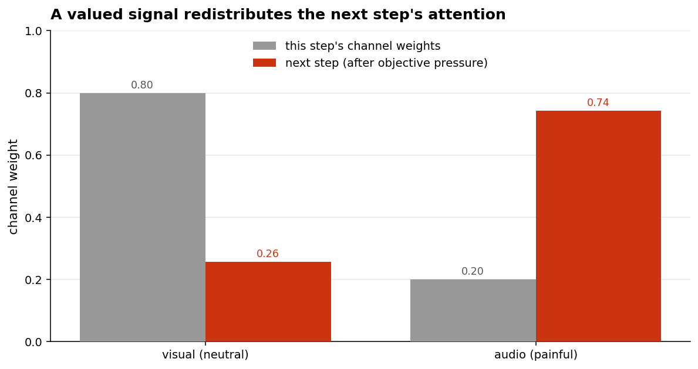

Two channels are sensed at once; the audio channel carries an affective cost. The
subject starts the step weighted toward vision (**0.80 / 0.20**), but the pain
signal on the audio channel reshapes the **next** step's allocation toward the
costly channel (**0.26 / 0.74**) — and the following step actually uses those
weights.

> **The distinction:** attention turns from a fixed gate into a managed policy.
> The subject still can't use what never entered, but once a valued signal partly
> enters, it can steer where attention goes next.

---

# Act IV — Emergence, and the controls that test it

## Page 8 — A skill that grows under pressure

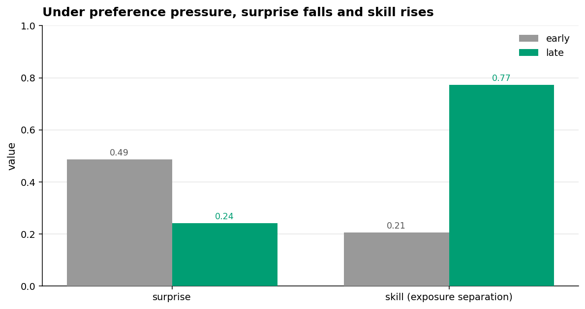

Put a subject with a preference and memory in a world that rewards approaching
safe cues and avoiding threats. Over the run, **surprise falls** (0.49 → 0.24) and
**skill** — its separation of good from bad exposure — **climbs** (0.21 → 0.77).
The crucial part is the controls (not pictured here, but in the same check): a
**no-memory** subject and a **no-preference** subject show **zero skill gain** and
**zero surprise drop**. The skill *depended on* the capacities.

> **The distinction:** useful behaviour can emerge from pressure — and the proof
> it's real is that removing the responsible capacity makes it vanish.

## Page 9 — Which roles survive an honest fake

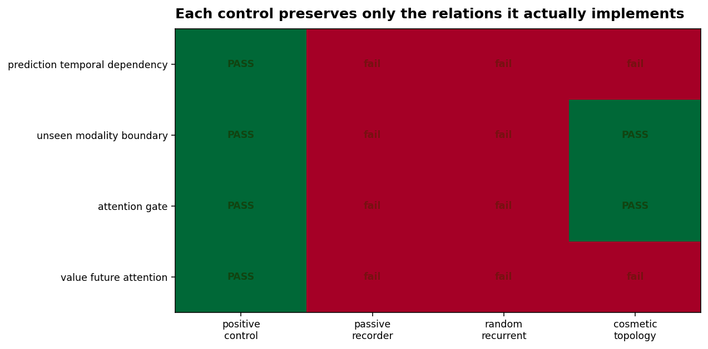

One authored sequence, run through a Cave-like **positive control** and three
impostors. The matrix reads each of four role-relations off the *episode*: the
positive control shows all four (**4/4**). A **passive recorder** and a **random
recurrent** state show **none** — copying inputs or carrying arbitrary state
imitates no relation. The **cosmetic-topology** faker is the interesting one: it
preserves the **modality boundary** and the **attention gate** (it does sense and
gate honestly) but *not* prediction history or value-shaped future attention —
the two relations a pretty picture can't fake.

> **The distinction:** role claims should be **episode-level dependencies**, not
> labels or decorations. A control preserves only the relations it actually
> implements.

## Page 10 — Every probe leaves a different mark

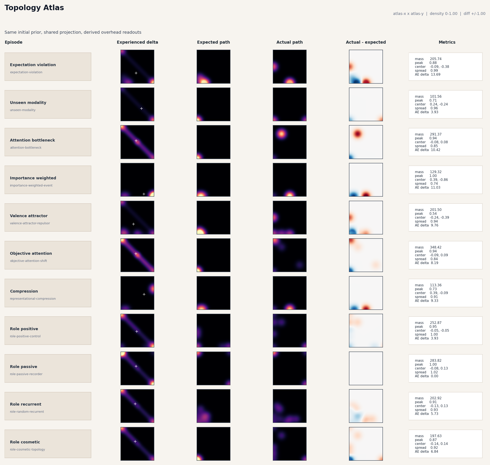

Finally, zoom out. The **topology atlas** reconstructs every probe and control
from the *same* flat prior and the *same* projection, then lays their traces in
one grid: experienced delta, the expected path, the actual path, and the
actual-minus-expected surface, with per-row mass, peak, centroid, and spread. The
rows are visibly different (max actual-vs-expected divergence **16.9**, peak
experienced mass **613**) — the probes don't just *claim* to differ, they leave
different footprints under one shared lens.

> **The distinction:** an inspection surface can compare probe impacts without
> letting the inspection (expected-input paths) leak into the real state.

---

## That's the idea

> A probe is a question with a control attached. Each one isolates a single
> relation — sensing, attention, compression, prediction, importance, valence,
> value-steering, emergence, role-dependency, topology — and each one ships with a
> check that fails if the relation isn't really there.

- The probes in full, with fixtures and CLI commands:
  [Canonical causal probes](../../../docs/experiments/scenarios.md).
- What the project does and does not claim: [the scope note](../../../docs/orientation/scope_note.md).
