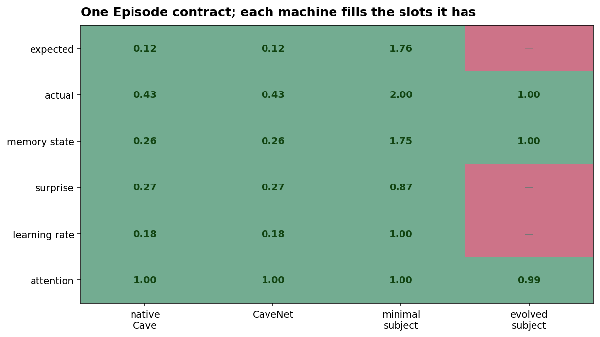
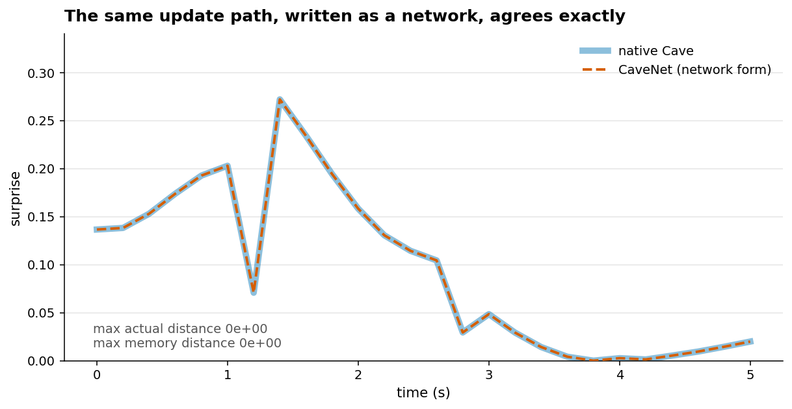
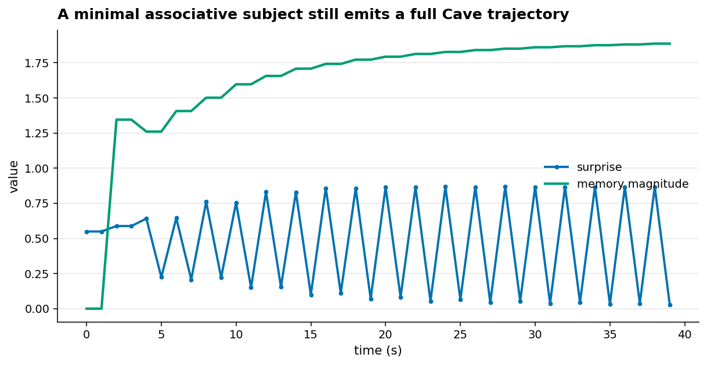
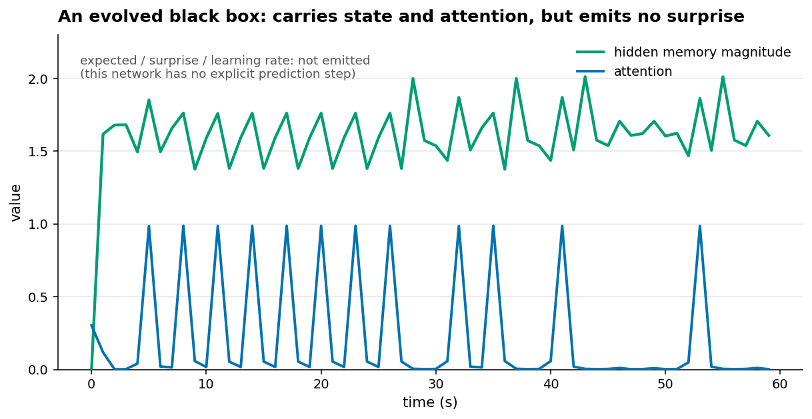
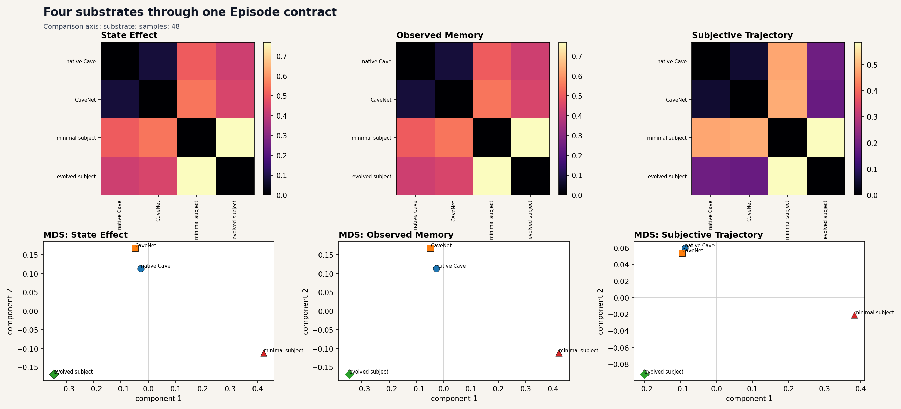
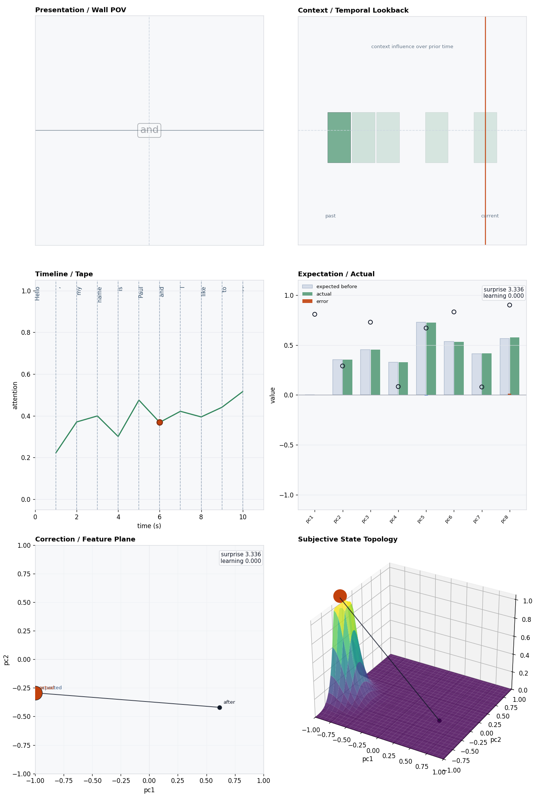
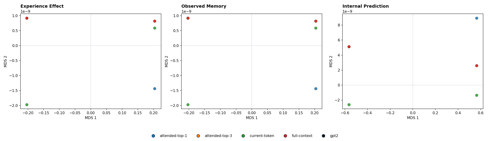
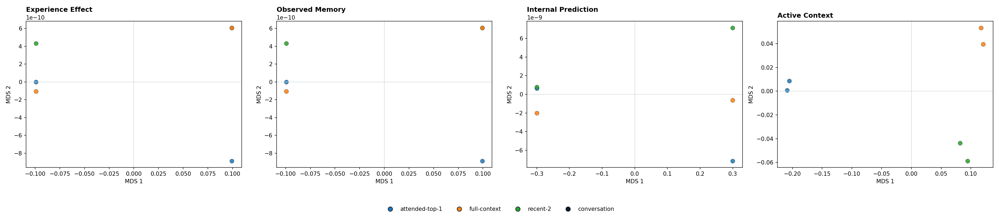

# Four machines, one contract: a Cave substrates storybook

It's tempting to picture Cave as *one kind* of machine — the native Cave subject,
dressed up as Jimmy. But Cave's real claim isn't about that one implementation.
It's about a **shape**: the `Episode`. A native Cave run, a network rewrite, a
stripped associative subject, an evolved recurrent black box — and even a GPT-2
forward pass or a conversation — all adapt into the *same* `Episode`, so the same
views and the same comparison tools can read any of them.

> **The thesis of this book:** the `Episode` is an interoperability contract.
> Different internals, one comparable shape. The contract is what makes any
> cross-substrate comparison possible at all.

An `Episode` is a list of observations, each with the same slots: **expected**
input, **actual** input, **memory state**, **surprise**, **learning rate**,
**attention** (plus error and metadata). A "substrate" is anything that fills
those slots, step by step. The interesting part is that *not every machine fills
every slot* — and that's allowed.

The generated substrate panels read their numbers live from the running
substrates; the GPT-2 and conversation coda uses committed reference outputs.

## How to read the machines

The story compares adapters, not labels. Each row below names the actual machine
that generates the `Episode`:

| Substrate | Internal machinery | Run used in this storybook | What its filled slots mean |
| --- | --- | --- | --- |
| Native Cave | the reference Cave loop: sensorium, attention policy, workspace, expectation readout, prediction error, learning, memory, topology | `CaveProducer(demo_model(seed=1)).run(...)` for the contract/equivalence panels | expected, actual, memory, surprise, learning rate, and attention are native Cave quantities |
| CaveNet | named network blocks: `attention_gate`, `workspace_block`, `expectation_readout`, `error_surprise_block`, value/objective readout, memory/topology cell | `CaveNet.from_subject_state(...)` on the same initial state as native Cave; Page 5 uses an adaptive CaveNet pressure run for the mixed dashboard | the default run should be bit-equivalent to native Cave; gain changes expose perturbations of that same path |
| Minimal subject | top-k workspace, associative successor traces, feature priority, preference vector, value/frequency memory modes | `build_preference_emergence_episode("minimal-preference")` | expected is associative readout, actual is workspace input, memory is trace summary, surprise is workspace-minus-expected |
| Evolved subject | recurrent controller `h_t = tanh(W_x obs_t + W_h h_{t-1} + b_h)` and exposure output `sigmoid(W_a h_t + b_a)` | `build_evolved_exposure_episode("evolved-recurrent")` | actual is current cue/outcome vector, memory is hidden state, attention is exposure; expected, surprise, and learning rate are blank because the network has no explicit prediction step |

The coda extends the same adapter idea to text: GPT-2 token streams and
conversation turns are wrapped as `Episode`s by producer code, then rendered by
the same views. Those text panels are committed references because the optional
model dependencies are not required for this storybook.

---

## Page 1 — The contract, and who fills it

Four machines, one set of slots. The **native Cave** subject fills all six. The
**CaveNet** column is *identical* to it (more on that next). The **minimal
subject** fills all six too, at its own scale (memory magnitude up to ~1.75,
surprise to ~0.87). The **evolved subject** is the honest outlier: it fills
**actual, memory, and attention**, but emits **no expected input, surprise, or
learning rate** — because it's a recurrent network with no explicit prediction
step. It still produces a valid `Episode`; it just leaves some slots empty.

> **The point:** the contract has slots, not requirements. A machine participates
> by filling what it actually computes — and what it leaves blank is itself
> information about how it works.

---

## Page 2 — CaveNet: the same path, written as a network

**CaveNet** rewrites the Cave update loop as an explicit network of blocks —
attention gate, workspace, expectation readout, error/surprise, learning,
topology — each with a named gain. Hand it the *same* starting subject and the
same world, and it reproduces the native trajectory **exactly**: the two surprise
curves lie on top of each other, and the comparison reports a **max actual
distance of 0** and a **max memory distance of 0**. Not "close" — bit-for-bit the
same readouts.

> **The point:** "symbolic Cave" and "Cave as a network" are two spellings of one
> computation. That equivalence is what licenses CaveNet as the place to *perturb*
> the path (turn a gain down, add a pressure rule) and still call it Cave.

---

## Page 3 — The minimal subject: how little you need

Strip the model down to an associative memory with a preference and a small
workspace bottleneck — the **minimal subject** — and drop it in a delayed-value
world for 40 steps. It still emits a complete Cave trajectory: **memory magnitude
climbs** as it accumulates structure, while **surprise sawtooths** with the
arriving cues. It is a different, much simpler machine (`adapter = MinimalSubject`),
yet a reader of `Episode`s can't tell it needs special handling.

> **The point:** the contract doesn't presuppose the full reference architecture.
> A deliberately impoverished subject fills the same slots — which is exactly what
> makes it a fair control in the pressure experiments.

---

## Page 4 — The evolved subject: a black box that still fits

The **evolved subject** is the furthest from Cave: a small recurrent network
evolved purely for survival in a delayed-value world, over a vocabulary that isn't
even Cave's (`cue_good, cue_bad, good, bad, neutral`). We never told it about
expectation or memory. Yet its run adapts into an `Episode` whose **hidden memory
magnitude** and **attention** are populated and meaningful — while expected,
surprise, and learning rate stay blank, because it has no prediction step to
report.

> **The point:** an opaque machine, grown rather than built, *still* exports a
> comparable trajectory. Its empty slots are honest; its filled ones are enough to
> place it beside the others.

---

## Page 5 — All four in one space

Because they share the contract, the **episode-set dashboard** can embed all four
substrates in one space and print their pairwise distances. Native Cave, CaveNet,
the minimal subject, and the evolved subject (four *different* adapters) become
four points whose distances are a real, numeric measure of how similarly they
moved through their worlds.

> **The careful reading:** proximity here is **functional resemblance, not
> identity**. The dashboard shows comparable *trajectories*; it does **not** claim
> the machines share internal variables or coordinates. The shared contract is
> what lets us compare; it is not a claim that the insides are the same. (See the
> [scope note](../../../docs/orientation/scope_note.md).)

---

## Coda — The contract already reaches language

The four substrates above are all small, hand-runnable systems. But the same
`Episode` adapter has been wrapped around text models, too.

A **GPT-2** forward pass maps into a Cave episode: a token context is the
"presentation," the model's next-token distribution and hidden state fill the
expectation/actual and memory slots, and the standard six-panel view renders it,
now reading a language model's step.

And a **conversation** producer turns turn-by-turn dialogue into episodes, so a
whole population of text runs can be compared with the same population dashboard
as a population of Jimmys. *(GPT-2 and the conversation producer need optional
model dependencies to re-run; the figures here are the committed reference
outputs.)*

> **The point:** the contract was never about shapes on a wall. Anything that can
> be made to fill the slots — a symbolic subject, a network, an evolved genome, a
> transformer — becomes comparable on the same terms.

---

## That's the idea

> Cave is not one model; it's a contract. The `Episode` defines the slots —
> expected, actual, memory, surprise, learning rate, attention — and any machine
> that fills what it computes joins one comparable space. Equivalent rewrites
> (CaveNet) agree to the bit; impoverished and evolved and even text substrates
> fit the same shape; what each leaves blank is part of the story.

- The substrates in code: [`cave/substrates/`](../../../cave/substrates/) — CaveNet,
  minimal subject, evolved subject.
- The producers that wrap text models: [Producers](../../../docs/producers/README.md).
- What "functional resemblance, not identity" licenses: [the scope note](../../../docs/orientation/scope_note.md).
