# Two Inks: how a walk becomes a country

The other storybooks unify: the [main demo](../main_demo/storybook.md) shows
all six views at once, and the [primitive demo](../primitive_demo/docs/storybook.md)
runs the whole kernel loop. In both, the subjective topology arrives as the
*last panel* — "and here is what accumulated" — and is never explained on its
own terms. This book does the opposite. It explains exactly one object, the
**subjective topology**, from first principles, one ingredient per page, and
treats everything else as supporting cast.

The question it answers is the one the field-of-color panel always raises:

> **Why is a terrain a good representation of subjective experience —
> and what, exactly, is the height?**

The walk is the interactive game's canonical route, run through the real game
machinery and deposited by the real engine
(`SubjectiveTopologyState.update`). The plane is the game's feature plane —
**novelty** across, **angularity** up — with a flat prior, so every page here
matches what the trajectory-space game draws and what the topology atlas
measures.

```text
tree   [0.0 – 1.0)    calm, familiar       peak surprise 0.19
rock   [1.2 – 2.2)    dull                 peak surprise 0.05
tree   [2.4 – 3.4)    calm, again          peak surprise 0.15
snake  [3.6 – 4.6)    vivid, far away      peak surprise 0.26
```

The thesis, up front: **experience is not a list of events. It is what events
leave behind, and what they leave behind has a shape.** The shape is written
in two inks — one by the world, one by the dreamer — on a single map.

---

## Page 1 — The plane: places are kinds

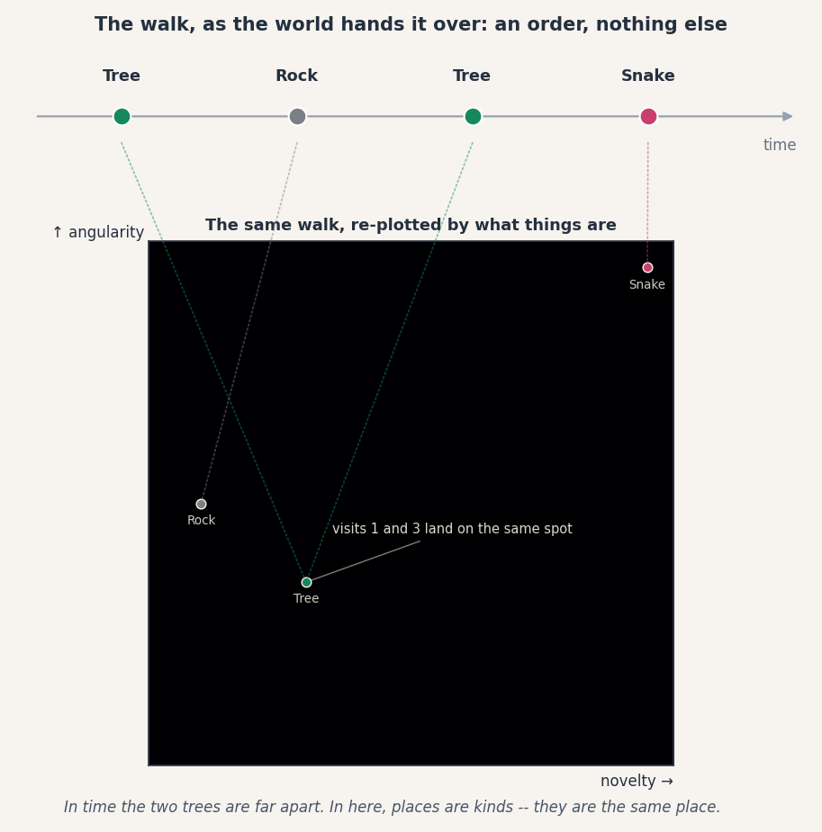

The world hands the subject an *order*: tree, rock, tree, snake. That is the
top strip — a timeline, distance meaning "when," and nothing else. On the
timeline, the snake's only property is *fourth*.

The dark square below is the same walk re-plotted by *what things are*. Each
object sits at its feature coordinates: how novel it is (across), how angular
it is (up). And the first lesson is already on the page: in time, the two
trees are far apart; in here they are **the same place**. Visits 1 and 3 land
on the same spot, because in this space, places are kinds and distance means
difference.

Everything else in this book happens on this square.

---

## Page 2 — One experience, one deposit

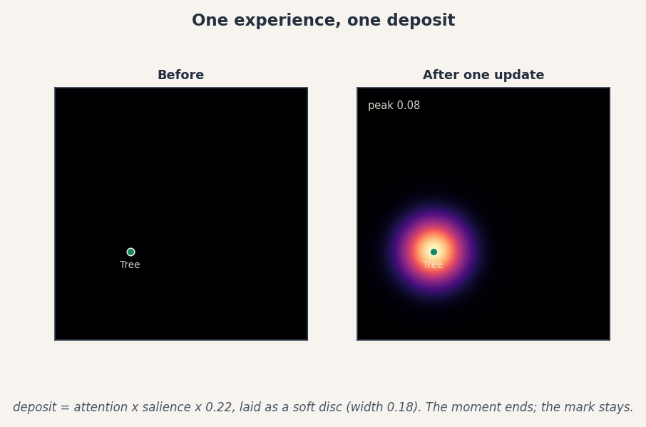

One update of the engine, with one tree on stage. The result is not a line in
a diary — it is a **stamp**: a soft disc of density at the tree's place,

```text
deposit = attention × salience × 0.22     laid with width 0.18
```

The moment ends. The mark stays. This is the atom of subjective topology: a
subject does not keep its experiences, it keeps what they did to it.

---

## Page 3 — The stamp ages

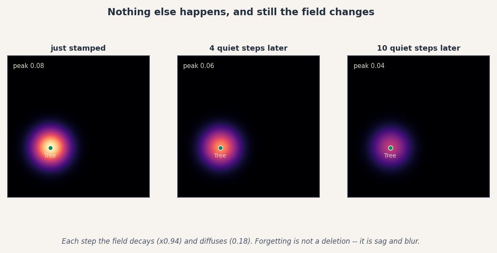

Now nothing happens — ten steps of empty world — and still the field changes.
Each step the density decays (× 0.94) and diffuses (0.18 toward its
neighbors): the peak falls from 0.08 to 0.04 while the disc spreads.

**Forgetting is in the field.** Not a deletion, but sag and blur — old
experience doesn't vanish, it loses its sharpness and sinks back toward the
plain.

---

## Page 4 — Stamps pile: a hill is a habit

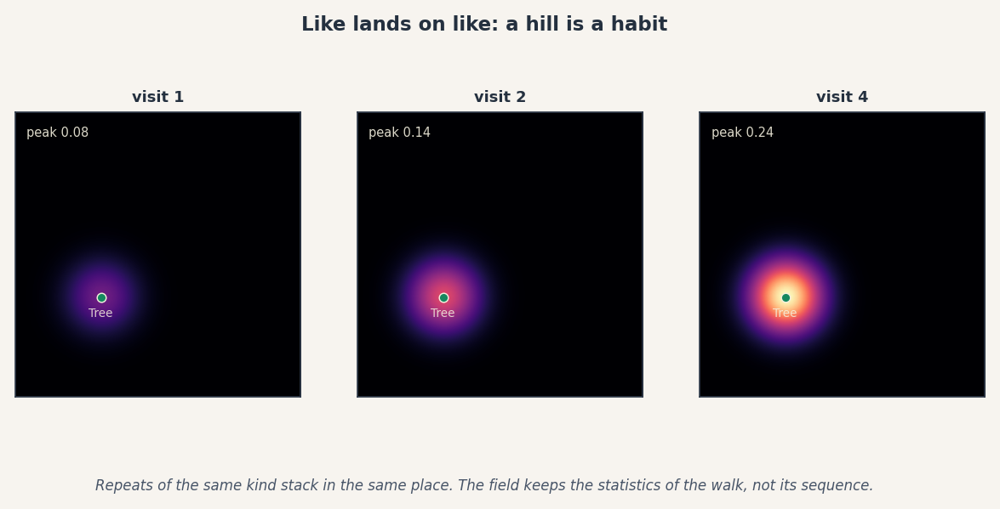

Visit the tree again and again and the stamps land **on the same spot** —
because the spot encodes what the tree *is*, not when it appeared. Four
visits: the peak climbs 0.08 → 0.14 → 0.24. A hill forms.

This is why the field is a better record than the diary: it keeps the
*statistics* of a life, not its sequence. Where experience has piled up, the
country is high. The two trees of our walk will share one hill.

---

## Page 5 — The second ink

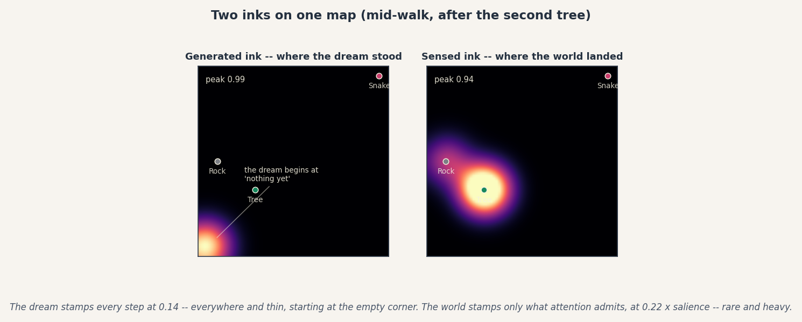

So far only the world has written. But the engine's field is literally a sum
of two tagged components, and here they are mid-walk, just after the second
tree.

On the right, the **sensed ink**: deposits at the objects attention admitted,
at strength 0.22 × salience — *rare and heavy*. On the left, the **generated
ink**: a deposit at wherever the subject's expectation stood, every single
step, at strength 0.14 — *everywhere and thin*. The dream stamps constantly;
the world stamps selectively.

And note where the dream begins: in the corner, at "nothing yet." Before
anything has been seen, the expectation is empty — zero novelty, zero
angularity — and its ink pools at the map's origin of innocence. The dream
only moves into the country as experience drags it there.

---

## Page 6 — Roads

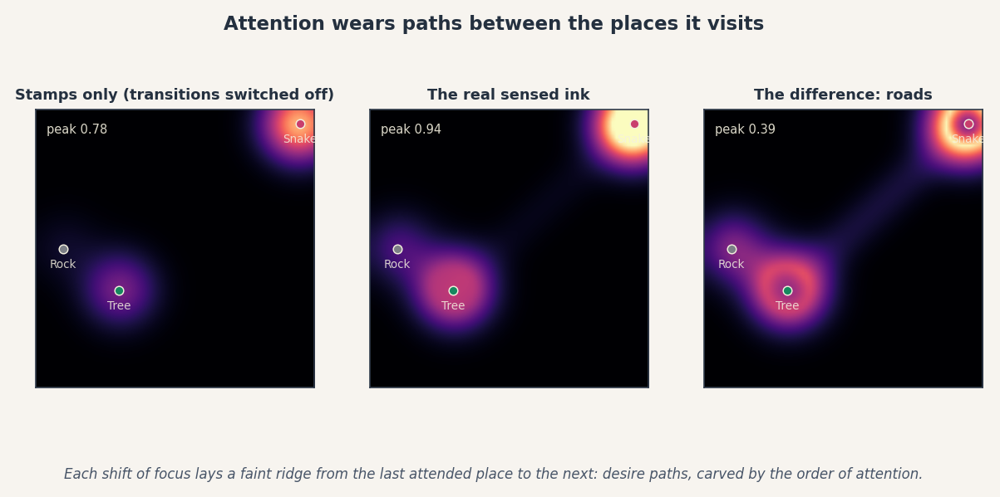

The sensed ink is not just hills. Every time attention shifts from one object
to the next, the engine lays a faint ridge along the line between them
(strength 0.08, gated by attention capacity). Switch that off and you get the
left panel — stamps only. The real field is the middle. The difference is the
right panel: **roads**.

These are desire paths. The order of attention wears trails between the
places it visits, so the finished country remembers not only *what* was
experienced but *what followed what*. The brightest road in this walk runs
from the tree-hill to the snake.

---

## Page 7 — The gatekeeper

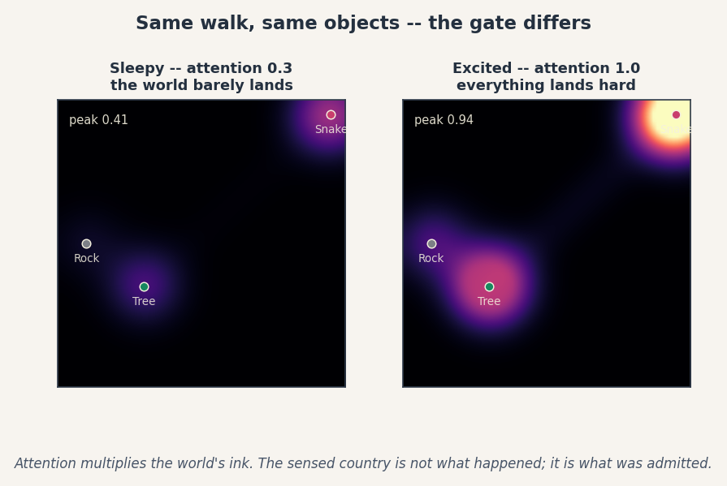

Same walk, same objects, same engine — different gate. Sleepy attends at 0.3
and the world barely lands: peak 0.41. Excited attends at 1.0 and everything
lands hard: peak 0.94.

The sensed country is therefore **not what happened**. It is what was
*admitted*. Attention multiplies the world's ink, which means the terrain is
subjective all the way down — even the "objective" ink passed through the
subject to get onto the map.

---

## Page 8 — Field and thread

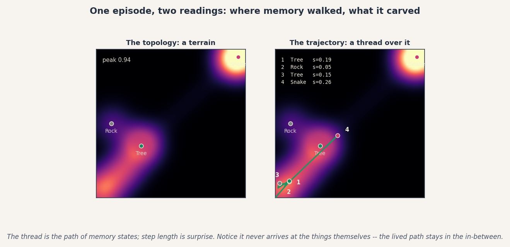

Two different objects are derived from the same episode, and this page keeps
them apart — because conflating them is the easiest way to misread every
picture in this repository.

The **topology** is the terrain: a field of accumulated density. The
**trajectory** is the thread: the path of memory states, step by step. Step
length is surprise — stops 1–3 are short, huddled steps in the lowland
(s = 0.19, 0.05, 0.15), and then the snake yanks the thread toward the far
corner (s = 0.26).

Notice the thread **never arrives at the things themselves**. Memory moves
only a fraction of the way toward each object before the next one comes. The
lived path stays in the in-between — the country's hills stand at the world's
places, and the subject's actual route winds beneath them.

---

## Page 9 — The split

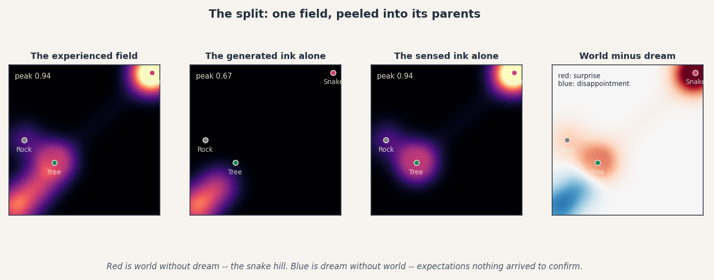

The finished field, peeled into its parents. The experienced field (left) is
the sum the subject lives on. The generated ink alone is the dream's
autobiography — the trail from "nothing yet" toward the tree-hill, peak 0.67.
The sensed ink alone is the world's — hills at tree and snake, roads between,
peak 0.94.

And the rightmost panel is the payoff of keeping two inks: **world minus
dream**. Red is world without dream — the snake hill, sensed mass the
expectation never generated. That is *surprise, drawn as geography*. Blue is
dream without world — the corner trail, generated mass nothing arrived to
confirm. That is *disappointment, drawn as geography*.

One map. Two inks. The difference between them is what the walk felt like.

---

## Page 10 — Two countries

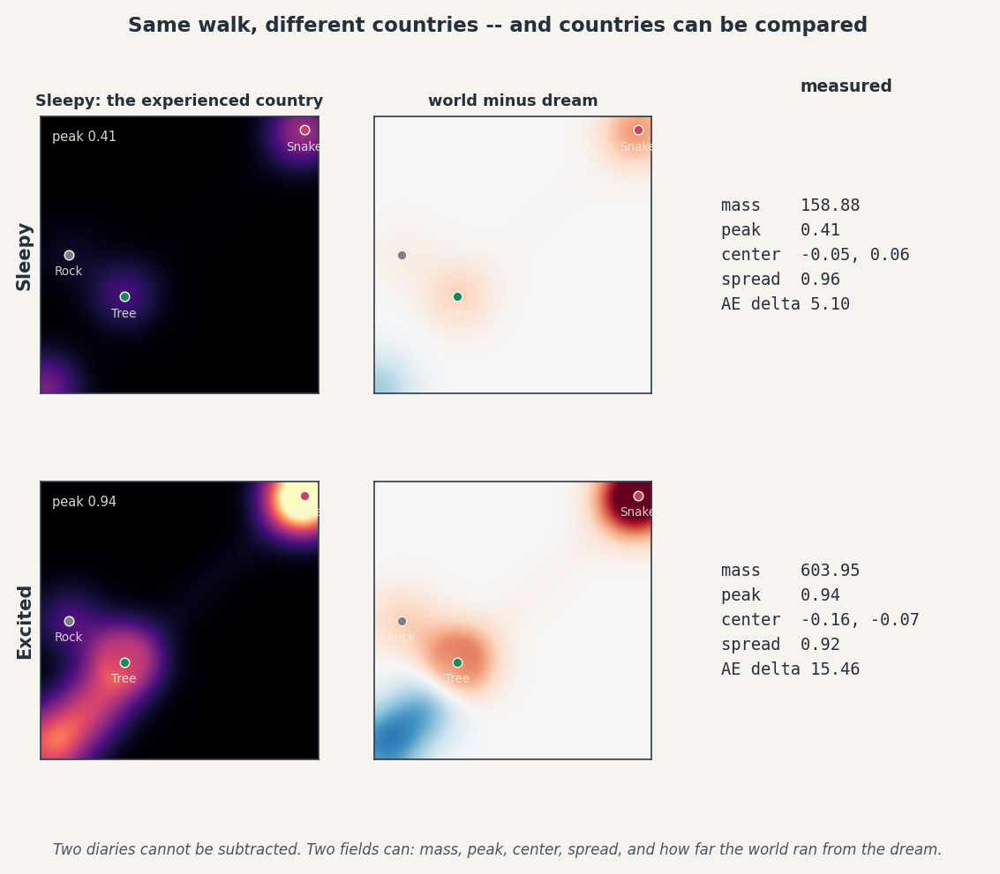

Why insist on a field instead of any other summary? Because **two diaries
cannot be subtracted, and two fields can.**

Sleepy and Excited walk the identical route and build different countries:

```text
          mass     peak    spread    world−dream (L2)
Sleepy    158.9    0.41    0.96       5.10
Excited   604.0    0.94    0.92      15.46
```

Same world, four times the lived mass, three times the felt gap between dream
and delivery. These numbers are the atlas's vocabulary (mass, peak, centroid,
spread, actual−expected delta), and they are how the rest of this repository
asks its real questions: do trajectories converge across subjects, pressures,
substrates? The inside, rendered as a country, becomes *comparable* — which
is the whole reason to render it this way.

---

## Page 11 — From ink to terrain

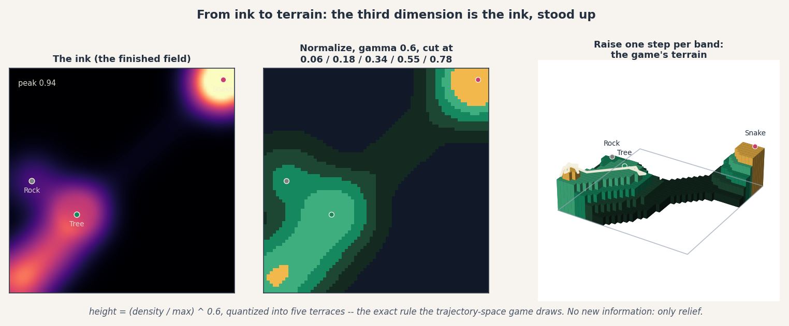

Everything so far was flat — ink on a map. The game, the surface views, and
the finale you rotate are all built from one last move, and it is smaller
than it looks:

```text
height = (density / max) ^ 0.6        normalize, soften with gamma
band   = how many of {0.06, 0.18, 0.34, 0.55, 0.78} the height clears
relief = one step per band            five terraces, flat tops
```

That is the entire transformation — the exact rule the trajectory-space game
draws with (`gamma 0.6`, the five thresholds, one step of elevation per
band). The gamma lifts the quiet lowlands so faint experience still registers;
the bands quantize the country into walkable terraces; the extrusion adds
**no new information**. The third dimension is just the ink, stood up.

This is also the metaphor's honest punchline. The subject's 2D sprite walks
*on* this surface, but nothing about the surface is anywhere the subject can
look — height is not a place, it is *how much living has happened at a
place*. When the game tilts the camera and the country rises, you are not
seeing a new world; you are seeing the same map gain the dimension the
subject can feel but never see. The thread drapes over the terraces it
deposited — the walk, resting on what the walk built.

---

## How to read any topology panel now

- **The plane** is every experience the subject could have, arranged by kind.
- **Height** is where experience has piled up — two inks: the world's (heavy,
  gated by attention) and the dream's (thin, laid every step).
- **Hills** are habits. **Roads** are the order of attention. **Sag and
  blur** are forgetting.
- **The thread** over the terrain is the trajectory — memory's actual route,
  step length equal to surprise. The thread never quite reaches the hills.
- **World minus dream** is the walk's affect map: red where life outran
  expectation, blue where expectation outran life.
- **The terraces** in any 3D view are the same field through one rule —
  `(density / max)^0.6`, cut at five thresholds, one step per band. Relief is
  presentation, not new data.

To regenerate the panels:

```bash
python notebooks/demos/topology_demo/generate_topology_storybook.py
```

For the measurement-grade version of pages 9–10 across many episodes, see the
topology atlas (`cave/presentation/renderers/topology_atlas_renderer.py` and
the `topology_atlas` scenario). For the machinery itself, see
`cave/commitments/topology/state.py` and tutorial 1
(`notebooks/tutorials/01_intro_to_cave_subjective_trajectory.ipynb`).
